# Clean Python Code

## Table of Contents


1. [Introduction](#introduction)

2. [Naming Things](#naming-Things)

   - [Use intention revealing name](#Use-intention-revealing-name)
   - [Meaningful Distinctions](#Meaningful-Distinctions)
   - [Avoid Disinformation](#Avoid-Disinformation)
   - [Pronounceable Names](#Pronounceable-names)
   - [Search-able Names](#Searchable-Names)
   - [Don't be cute](#Don't-be-cute)
   - [Avoid Encodings](#Avoid-Encodings)
     - [Hungarian Notation](#Hungarian-Notation)
     - [Member Prefixes](#Member-Prefixes)
     - [Interfaces & Implementations](#Interfaces-&-Implementations)
   - [Gratuitous Context](#Gratuitous-Context)
   - [Avoid Mental Mapping](#Avoid-Mental-Mapping)
   - [Class Names](#Class-Names)
     - [Types of Objects](#Types-of-Objects)
     - [Simple Superclass Name]()
     - [Qualified Subclass Name]()
   - [Method Names]()
   - [Pick One Word per Concept]()
   - [Don't Pun]()
   - [Use Solution Domain Names]()
   - [Use Problem Domain Names]()
   - [Add Meaningful Context]()

3. [Functions](#functions)
   - [Small](#Small)
   - [Do One Thing](#Do-One-Thing)
   - [One level of Abstraction](#One-level-of-Abstraction)
   - [Avoid Conditionals](#Avoid-Conditionals)
   - [Use Descriptive Names](#Use-Descriptive-Names)
   - [Function Arguments](#Function-Arguments)
   - [Avoid Side Effects](#Avoid-Side-Effects)
     - [Pure Functions](#Pure-Functions)
     - [Niladic Functions](#Niladic-Functions)
     - [Argument Mutation](#Argument-Mutation)
     - [Exceptions](#Exceptions)
     - [I/O](#I/O)
   - [Command Query Separation](#Command-Query-Separation)
   - [Don't Repeat Yourself](#Don't-Repeat-Yourself)
4. [Objects and Data Structures](#objects-and-data-structures)
5. [Classes](#classes)
6. [SOLID Principles](#SOLID-Principles)
   - [Single Responsibility Principle](#Single-Responsibility-Principle)
   - [Open/Close Principle](#Open/Closed-Principle)
   - [Liskov Substitution Principle](#Liskov-Substitution)
   - [Interface Segregation Principle](#Interface-Segregation)
   - [Dependency Inversion Principle](#Dependency-Inversion-Principle)
7. [Testing](#testing)
8. [Concurrency](#concurrency)
9. [Error Handling](#error-handling)
10. [Formatting](#formatting)
11. [Comments](#comments)
12. [Translation](#translation)

Software engineering principles, from Robert C. Martin's book
[_Clean Code_](https://www.amazon.com/Clean-Code-Handbook-Software-Craftsmanship/dp/0132350882),
adapted for Python. This is not a style guide. It's a guide to producing readable, reusable, and refactorable software in Python.

## Introduction

---

## Naming Things

---

Modern software is so complex that no one can understand all parts of a big project alone. The only way humans handle all these details is through abstractions. With abstraction, we focus on the important stuff and forget about the not-so-important stuff at that particular time. You remember the way you learned body biology? You focused on one system at a time, like digestive, nervous, cardiovascular etc. and ignored the rest. That is abstraction at work.

A variable name is an abstraction over memory, a function name is an abstraction over logic, a class name is an abstraction over a packet of data and the logic that operates on that data.

The most important abstraction in writing software is **naming**. Naming things is just one part of the story, using good names is a skill that unfortunately, is not owned by most programmers and that is why we have come up with so many refactorings concerned with naming things.

Good names bring order to the chaotic environment of crafting software and hence, we better be good at this skill so that we can enjoy our craft.

**[⬆ back to top](#table-of-contents)**

### **Use intention revealing names**

---

This rule says that programmers should make their code read like well written prose by naming parts of their code perfectly. With such good naming, a programmer will never need to resort to comments or unnecessary doc strings.

Below is a code snippet from a software system. Would you make sense of it without any explanation?

**Bad** 😠

```python
from typing import List

def f(a : List[List[int]])->List[List[int]]:
    return [i for i in a if i[1] == 0]
```

It would be embarrassing that someone would fail to understand such a simple function. What could have gone wrong?

The problem is simple. This code is full of **mysterious names**. We have to agree that this is code and not a detective novel. Code should be clear and precise.

What this code does is so simple. It takes in a collection of orders and returns the pending orders. Let's pause for a moment and appreciate the extreme over engineering in this solution.

The programmer assumes that each order is coded as a list of `ints` (`List[int]`) and that the second element is the order status. He decides that 0 means pending and 1 means cleared.

Notice the first problem... that snippet doesn't contain knowledge about the domain. This is a design smell known as a **missing abstraction**. We are missing the Order abstraction.

> **Missing Abstraction** <br>
> This smell happens when clumps of data are used instead of creating a class or an interface

We have a thorny problem right now, we lack meaningful domain abstractions. One of the ways of solving the missing abstraction smell is to **map domain entities**. So let's create an abstraction called Order.

```python
from typing import List

class Order:
    def __init__(self, order_id : int, order_status : int) -> None:
        self._order_id = order_id
        self._order_status = order_status

    def is_pending(self) -> bool:
            return self._order_status == 0:

    #more code goes here
```

> We could also have used the **namedtuple** in the python standard library but we won't be too functional that early. Let us stick with OOP for now. **namedtuples** contain only data and not data with code that acts on it.

Let us now refactor our entity names and use our newly created abstraction too. We arrive at the following code snippet.

**Better** 😊

```python
from typing import List

Orders = List[Order]

def get_pending_orders(orders : Orders)-> Orders:
    return [order for order in orders if order.is_pending()]
```

This function reads like well written prose.

Notice that the `get_pending_orders()` function delegates the logic of finding the order status to the Order class. This is because the Order class knows its internal representation more than anyone else, so it better implement this logic. This is known as the **Most Qualified Rule** in OOP.

> **Most Qualified Rule** <br>
> Work should be assigned to the class that knows best how to do it.

> We are using the listcomp for a reason. Listcomps are examples of **iterative expressions**. They serve one role and that is creating lists. On the other hand, for-loops are **iterative commands** and thus accomplish a myriad of tasks. Pick the right tool for the job.

Never allow client code to know your implementation details. In fact the ACM A.M Laureate Barbara Liskov says it soundly in her book [Program development in Java. Abstraction, Specification and OOD](https://book4you.org/book/1164544/93467d). The **Iterator design pattern** is one way of solving that problem.

Here is another example of a misleading variable name.

**Bad** 😠

```python
student_list= {'kasozi','vincent', 'bob'}
```

This variable name is so misleading.

- It contains noise. why the list suffix?
- It is lying to us. Lists are not the same as sets. They may all be collections but they are not the same at all.

To prove that lists are not sets, below is a code snippet that returns the methods in the List class that aren't in the Set class.

```python
sorted(set(dir(list())) - set(dir(set())))
```

Once it has executed, `append()` is one of the returned functions implying that sets don't support `append()` but instead support `add()`. So you write the code below, your code breaks.

> Sets are not sequences like lists. In fact, they are unordered collections and so adding the `append()` method to the set class would be misleading. `append()` means we are adding at the end which may not be the case with sets.

**Bad** 😠

```python
student_list= {'kasozi','vincent', 'bob'}
student_list.append('martin') #It breaks!!
```

It is better to use a different variable name that is neutral to the data structure being used.
In this case, once you decide to change data structure used, your variable won't destroy the semantics of your code.

**Good** 😊

```python
students = {'kasozi', 'vincent', 'bob'}
```

> You can not achieve good naming with a bad design. You can see that mapping domain entities into our code has made our codebase use natural names.

**[⬆ back to top](#table-of-contents)**

## Meaningful-Distinctions

---

When naming variables, functions, or classes, make sure that the names are distinct enough to avoid confusion. Names that are too similar can lead to bugs and make code harder to understand.

**Bad** 😠

```python
def get_user_data(user_id: int):
    user = get_user(user_id)
    users = get_all_users()
    return user
```

The problem here is that `user` and `users` are too similar and can cause confusion. What's the difference between them? It's not immediately clear.

**Good** 😊

```python
def get_user_data(user_id: int):
    current_user = get_user(user_id)
    all_users = get_all_users()
    return current_user
```

Now it's clear that `current_user` refers to a single user, while `all_users` refers to a collection of users.

**Another example:**

**Bad** 😠

```python
class Account:
    def __init__(self, balance: float):
        self.balance = balance
        self.balance_history = []

def transfer_money(from_account: Account, to_account: Account, amount: float):
    from_account.balance -= amount
    to_account.balance += amount
```

**Good** 😊

```python
class Account:
    def __init__(self, balance: float):
        self.current_balance = balance
        self.transaction_history = []

def transfer_money(source_account: Account, destination_account: Account, amount: float):
    source_account.current_balance -= amount
    destination_account.current_balance += amount
```

The key principles for meaningful distinctions:

1. **Use descriptive prefixes/suffixes**: `current_balance` vs `balance_history`
2. **Be specific about context**: `source_account` vs `destination_account`
3. **Avoid single-letter differences**: `user` vs `users` is confusing
4. **Make differences obvious**: The distinction should be immediately clear

**[⬆ back to top](#table-of-contents)**

## Avoid-Disinformation

---

Avoid names that provide false information or mislead the reader about what the code actually does. Names should accurately represent what they contain or what they do.

**Bad** 😠

```python
# This is misleading - it's not actually a list!
student_list = {'alice', 'bob', 'charlie'}  # This is a set, not a list

# This suggests it's a single user, but it's actually a collection
user = ['alice', 'bob', 'charlie']

# This suggests it's a boolean, but it's actually a string
is_active = "yes"  # Should be True/False or "active"/"inactive"
```

**Good** 😊

```python
# Clear about the data structure
students = {'alice', 'bob', 'charlie'}  # Set of students
student_set = {'alice', 'bob', 'charlie'}  # Explicit about being a set

# Clear about the collection
users = ['alice', 'bob', 'charlie']  # List of users
user_list = ['alice', 'bob', 'charlie']  # Explicit about being a list

# Clear about the data type
is_active = True  # Boolean
status = "active"  # String status
```

**More examples of misleading names:**

**Bad** 😠

```python
# Misleading - suggests it's a single account
account = [account1, account2, account3]

# Misleading - suggests it's a function, but it's a variable
def calculate_total():
    return total

# Misleading - suggests it's a constant, but it's mutable
MAX_RETRIES = 3
MAX_RETRIES = 5  # This is allowed but misleading

# Misleading - suggests it's a list, but it's a dictionary
user_list = {'id': 1, 'name': 'Alice'}
```

**Good** 😊

```python
# Clear about the collection
accounts = [account1, account2, account3]
account_list = [account1, account2, account3]

# Clear about the variable
total = calculate_total()

# Use proper constant naming
MAX_RETRIES = 3  # Use UPPER_CASE for constants
# Or use a class constant
class Config:
    MAX_RETRIES = 3

# Clear about the data structure
user_dict = {'id': 1, 'name': 'Alice'}
user_data = {'id': 1, 'name': 'Alice'}
```

**Common misleading patterns to avoid:**

1. **Data structure mismatches**: `list` for sets, `dict` for lists
2. **Type mismatches**: `is_` prefix for non-booleans
3. **Collection vs single item**: `user` for multiple users
4. **Mutable constants**: `MAX_RETRIES` that can be changed
5. **Function names for variables**: `calculate_total` as a variable name

**[⬆ back to top](#table-of-contents)**

## Pronounceable-names

---

When naming things in your code, it is much better to use names that are easy to pronounce by programmers. This enables developers to discuss the code without the need to sound silly as they mention the names. If you are a polyglot in natural languages, it is much better to use the language common to most developers when naming your entities.

**Bad** 😠

```python
from typing import List
import math

def sqrs(first_n : int)-> List[int]:
    if first_n > 0:
        return [int(math.pow(i, 2)) for i in xrange(first_n)]
    return []

lstsqrs = sqrs(5)
```

How can a human pronounce sqrs and lstsqrs? This is a serious problem. Let's correct it.

**Good** 😊

```python
from typing import List
import math

def generate_squares(first_n : int)-> List[int]:
    if first_n > 0:
        return [int(math.pow(i, 2)) for i in xrange(first_n)]
    return []

squares = generate_squares(5)
```

**[⬆ back to top](#table-of-contents)**

### Searchable-Names

For example, you're looking for some part of code where you calculate something and remember that was about work days in week

**Bad** 😠

```python
for i in range(0,34):
     s += (t[i]*4)/5
```

What is easier to find ```5``` or ```WORK_DAYS_PER_WEEK```?

It's normal to name local variable as one char in short functions but if you can avoid it

**Good** 😊

```python
from typing import Final

real_days_per_ideal_day: int = 4
WORK_DAYS_PER_WEEK: Final[int] = 5
sum: int = 0
for i in range(0,number_of_tasks):
    real_task_days: int = task_estimate[i] * real_days_per_ideal_day
    real_task_weeks: int = real_task_days / WORK_DAYS_PER_WEEK
    sum: int += real_task_weeks
```

**[⬆ back to top](#table-of-contents)**

### Don't-be-cute

---

Avoid using cute, funny, or clever names in your code. While they might seem amusing at the time, they make code harder to understand and maintain. Code should be professional and clear.

**Bad** 😠

```python
# Cute but unclear names
def whack_a_mole(bug_list):
    for bug in bug_list:
        if bug.is_critical:
            squish_bug(bug)

def holy_grail_search(target):
    return find_needle_in_haystack(target)

# Funny but confusing
def boogie_woogie(data):
    return shuffle_and_dance(data)

# Clever but unclear
def xyzzy():
    return perform_magic()
```

**Good** 😊

```python
# Clear and professional names
def fix_critical_bugs(bug_list):
    for bug in bug_list:
        if bug.is_critical:
            resolve_bug(bug)

def search_for_target(target):
    return find_item(target)

# Clear and descriptive
def randomize_data(data):
    return shuffle_data(data)

# Clear and meaningful
def initialize_system():
    return setup_application()
```

**More examples of cute names to avoid:**

**Bad** 😠

```python
# Cute but unprofessional
def oops_i_did_it_again():
    return retry_operation()

def abracadabra(data):
    return transform_data(data)

def hocus_pocus():
    return perform_initialization()

# Funny but unclear
def boom_shakalaka():
    return execute_explosive_operation()

def yippee_ki_yay():
    return celebrate_success()
```

**Good** 😊

```python
# Professional and clear
def retry_failed_operation():
    return retry_operation()

def transform_input_data(data):
    return transform_data(data)

def initialize_application():
    return perform_initialization()

# Clear and descriptive
def execute_critical_operation():
    return execute_explosive_operation()

def log_success():
    return celebrate_success()
```

**Why avoid cute names:**

1. **Professionalism**: Code is read by many people over time
2. **Clarity**: Cute names don't explain what the code does
3. **Maintenance**: Future developers (including yourself) need to understand the code
4. **Searchability**: Cute names are hard to search for in documentation
5. **International teams**: Cute names might not translate well across cultures

**Exceptions:**
- **Test data**: Using funny names for test data is sometimes acceptable
- **Temporary code**: For throwaway scripts, cute names might be okay
- **Personal projects**: For learning or personal use, cute names are less problematic

**Remember**: Code is written once but read many times. Make it easy for future readers to understand what your code does.

**[⬆ back to top](#table-of-contents)**

### Avoid-Encodings

---

Avoid encoding type information or other metadata into variable names. Modern IDEs and type hints provide this information more clearly. Encoded names are harder to read and maintain.

**Bad** 😠

```python
# Hungarian notation - encoding type in name
strName = "Alice"
intAge = 25
boolIsActive = True
lstUsers = ['alice', 'bob']
dictConfig = {'host': 'localhost'}

# Member prefixes
class User:
    def __init__(self):
        self._strName = "Alice"  # Private string
        self.m_intAge = 25       # Member integer
        self.p_boolIsActive = True  # Public boolean
```

**Good** 😊

```python
# Clear names without encoding
name = "Alice"
age = 25
is_active = True
users = ['alice', 'bob']
config = {'host': 'localhost'}

# Clean class without prefixes
class User:
    def __init__(self):
        self.name = "Alice"
        self.age = 25
        self.is_active = True
```

**Why avoid encodings:**

1. **Type hints are better**: Modern Python supports type hints
2. **IDE support**: IDEs show type information automatically
3. **Readability**: Encoded names are harder to read
4. **Maintenance**: When types change, you have to update names
5. **Modern practice**: Current Python style guides discourage encodings

**[⬆ back to top](#table-of-contents)**

#### Hungarian-Notation

Hungarian notation is a naming convention where the type of a variable is encoded as a prefix in its name. This practice is generally discouraged in modern Python development.

**Bad** 😠

```python
# Hungarian notation examples
strUserName = "Alice"
intUserAge = 25
boolIsUserActive = True
lstUserList = ['alice', 'bob', 'charlie']
dictUserConfig = {'theme': 'dark', 'language': 'en'}
arrUserScores = [85, 92, 78]
```

**Good** 😊

```python
# Clean names with type hints
user_name: str = "Alice"
user_age: int = 25
is_user_active: bool = True
user_list: list[str] = ['alice', 'bob', 'charlie']
user_config: dict[str, str] = {'theme': 'dark', 'language': 'en'}
user_scores: list[int] = [85, 92, 78]
```

**Why avoid Hungarian notation:**

1. **Type hints are better**: Python's type hints are more explicit and IDE-friendly
2. **Maintenance burden**: When types change, you must update variable names
3. **Readability**: Prefixes make names longer and harder to read
4. **Modern IDEs**: IDEs show type information automatically
5. **Python philosophy**: Python emphasizes readability and simplicity

#### Member-Prefixes

Avoid using prefixes to indicate member variables or access levels. Python's naming conventions already handle this through underscore prefixes.

**Bad** 😠

```python
class User:
    def __init__(self):
        self.m_strName = "Alice"      # Member string
        self.m_intAge = 25            # Member integer
        self.p_boolIsActive = True    # Public boolean
        self._m_privateData = "secret"  # Redundant prefixes
```

**Good** 😊

```python
class User:
    def __init__(self):
        self.name = "Alice"           # Public attribute
        self.age = 25                 # Public attribute
        self.is_active = True         # Public attribute
        self._private_data = "secret" # Private attribute (single underscore)
```

**Python naming conventions:**

- **No prefix**: Public attributes (`name`, `age`)
- **Single underscore**: Protected/internal use (`_internal_method`)
- **Double underscore**: Name mangling for privacy (`__private_attr`)
- **Trailing underscore**: Avoid keyword conflicts (`class_`, `type_`)

**Why avoid member prefixes:**

1. **Python conventions**: Python has established naming patterns
2. **IDE support**: IDEs understand Python naming conventions
3. **Readability**: Prefixes add visual noise
4. **Consistency**: Follow Python's PEP 8 style guide

#### Interfaces-&-Implementations

Avoid encoding interface vs implementation information in names. Use clear, descriptive names that focus on what the class does, not how it's implemented.

**Bad** 😠

```python
# Encoding interface vs implementation
class IUserService:  # Interface prefix
    def get_user(self, user_id: int):
        pass

class UserServiceImpl:  # Implementation suffix
    def get_user(self, user_id: int):
        return self.user_repository.find_by_id(user_id)

class UserServiceMock:  # Mock suffix
    def get_user(self, user_id: int):
        return User(id=user_id, name="Test User")
```

**Good** 😊

```python
# Clear, descriptive names
class UserService:  # Base service
    def get_user(self, user_id: int):
        pass

class DatabaseUserService:  # Specific implementation
    def get_user(self, user_id: int):
        return self.user_repository.find_by_id(user_id)

class InMemoryUserService:  # Clear about storage type
    def get_user(self, user_id: int):
        return self.users.get(user_id)
```

**Better approach with abstract base classes:**

```python
from abc import ABC, abstractmethod

class UserService(ABC):
    @abstractmethod
    def get_user(self, user_id: int):
        pass

class DatabaseUserService(UserService):
    def get_user(self, user_id: int):
        return self.user_repository.find_by_id(user_id)

class InMemoryUserService(UserService):
    def get_user(self, user_id: int):
        return self.users.get(user_id)
```

**Why avoid interface/implementation encoding:**

1. **Python philosophy**: Python emphasizes duck typing
2. **Clarity**: Names should describe purpose, not implementation details
3. **Flexibility**: Implementation can change without renaming
4. **Modern patterns**: Use abstract base classes or protocols instead

### Gratuitous-Context

---

Avoid adding unnecessary context to names when the context is already clear from the surrounding code. Don't repeat information that's already obvious.

**Bad** 😠

```python
class UserManager:
    def __init__(self):
        self.user_manager_name = "UserManager"
        self.user_manager_id = 1
        self.user_manager_config = {}

    def get_user_manager_user(self, user_id):
        return self.user_manager_database.find_user(user_id)

    def create_user_manager_user(self, user_data):
        return self.user_manager_database.create_user(user_data)
```

**Good** 😊

```python
class UserManager:
    def __init__(self):
        self.name = "UserManager"
        self.id = 1
        self.config = {}

    def get_user(self, user_id):
        return self.database.find_user(user_id)

    def create_user(self, user_data):
        return self.database.create_user(user_data)
```

**More examples:**

**Bad** 😠

```python
# Redundant context
class ShoppingCart:
    def __init__(self):
        self.shopping_cart_items = []
        self.shopping_cart_total = 0

    def add_shopping_cart_item(self, item):
        self.shopping_cart_items.append(item)
        self.shopping_cart_total += item.price

# Unnecessary prefixes
def process_user_data_user_information(user_data):
    return validate_user_data(user_data)

def calculate_order_total_order_amount(order):
    return sum(item.price for item in order.items)
```

**Good** 😊

```python
# Clean context
class ShoppingCart:
    def __init__(self):
        self.items = []
        self.total = 0

    def add_item(self, item):
        self.items.append(item)
        self.total += item.price

# Clear without redundancy
def process_user_data(user_data):
    return validate_user_data(user_data)

def calculate_total(order):
    return sum(item.price for item in order.items)
```

**When context is helpful:**

```python
# Context is helpful when there's ambiguity
class User:
    def __init__(self):
        self.email = "user@example.com"
        self.work_email = "user@company.com"  # Context clarifies which email
        self.personal_phone = "123-456-7890"
        self.work_phone = "098-765-4321"     # Context clarifies which phone
```

**Guidelines:**

1. **Remove obvious context**: Don't repeat class/module names in method names
2. **Keep necessary context**: Use context when there's potential confusion
3. **Consider scope**: Context is more important in larger scopes
4. **Be consistent**: If you add context to one similar item, add it to all

### Avoid-Mental-Mapping

---

Avoid names that require mental translation or mapping to understand what they represent. Names should be self-explanatory and not require the reader to decode them.

**Bad** 😠

```python
# Requires mental mapping
def process_data(d):
    for i in d:
        if i > 0:
            print(f"Positive: {i}")

# Single letter variables
def calculate_total(items):
    t = 0
    for i in items:
        t += i.price
    return t

# Cryptic abbreviations
def calc_usr_bal(usr_id):
    return get_usr_bal(usr_id)

# Mathematical notation
def f(x, y):
    return x * y + 2 * x + 1
```

**Good** 😊

```python
# Self-explanatory names
def process_numbers(numbers):
    for number in numbers:
        if number > 0:
            print(f"Positive: {number}")

# Clear variable names
def calculate_total(items):
    total = 0
    for item in items:
        total += item.price
    return total

# Full words
def calculate_user_balance(user_id):
    return get_user_balance(user_id)

# Descriptive function name
def calculate_quadratic_value(x, y):
    return x * y + 2 * x + 1
```

**More examples of mental mapping to avoid:**

**Bad** 😠

```python
# Abbreviations that require decoding
def proc_req(req):
    return validate_req(req)

def calc_tax(amt, rate):
    return amt * rate

# Single letters in loops
for i in range(len(users)):
    for j in range(len(users[i].orders)):
        print(users[i].orders[j].total)

# Cryptic variable names
def process_data(data):
    res = []
    for d in data:
        if d['status'] == 'active':
            res.append(d['id'])
    return res
```

**Good** 😊

```python
# Clear, full words
def process_request(request):
    return validate_request(request)

def calculate_tax(amount, tax_rate):
    return amount * tax_rate

# Descriptive loop variables
for user_index in range(len(users)):
    for order_index in range(len(users[user_index].orders)):
        print(users[user_index].orders[order_index].total)

# Clear variable names
def process_data(data):
    active_user_ids = []
    for user_data in data:
        if user_data['status'] == 'active':
            active_user_ids.append(user_data['id'])
    return active_user_ids
```

**When single letters might be acceptable:**

```python
# Mathematical functions where x, y, z are conventional
def distance(x1, y1, x2, y2):
    return ((x2 - x1) ** 2 + (y2 - y1) ** 2) ** 0.5

# Very short, local scope
def process_items(items):
    for item in items:
        if item.is_valid:
            return item
    return None
```

**Guidelines for avoiding mental mapping:**

1. **Use full words**: `user_id` instead of `uid`
2. **Be descriptive**: `calculate_total` instead of `calc_tot`
3. **Avoid abbreviations**: `process_request` instead of `proc_req`
4. **Use meaningful loop variables**: `user_index` instead of `i`
5. **Consider context**: What's obvious to you might not be to others

## **Functions**

### **Small**

---

Functions should be small. The smaller they are, the easier they are to understand, test, and maintain. A good rule of thumb is that a function should fit on one screen.

**Bad** 😠

```python
def process_user_data(user_data):
    # This function is too long and does too many things
    if not user_data:
        return None

    # Validate user data
    if 'name' not in user_data or not user_data['name']:
        raise ValueError("Name is required")
    if 'email' not in user_data or not user_data['email']:
        raise ValueError("Email is required")
    if '@' not in user_data['email']:
        raise ValueError("Invalid email format")

    # Process user data
    user_data['name'] = user_data['name'].strip().title()
    user_data['email'] = user_data['email'].strip().lower()

    # Save to database
    connection = get_database_connection()
    cursor = connection.cursor()
    cursor.execute("INSERT INTO users (name, email) VALUES (?, ?)",
                   (user_data['name'], user_data['email']))
    connection.commit()
    cursor.close()
    connection.close()

    # Send welcome email
    email_service = EmailService()
    email_service.send_welcome_email(user_data['email'])

    # Log the action
    logger.info(f"User {user_data['name']} created successfully")

    return user_data
```

**Good** 😊

```python
def process_user_data(user_data):
    """Process and save user data."""
    validate_user_data(user_data)
    cleaned_data = clean_user_data(user_data)
    save_user_to_database(cleaned_data)
    send_welcome_email(cleaned_data['email'])
    log_user_creation(cleaned_data['name'])
    return cleaned_data

def validate_user_data(user_data):
    """Validate that user data contains required fields."""
    if not user_data:
        raise ValueError("User data is required")

    if 'name' not in user_data or not user_data['name']:
        raise ValueError("Name is required")

    if 'email' not in user_data or not user_data['email']:
        raise ValueError("Email is required")

    if '@' not in user_data['email']:
        raise ValueError("Invalid email format")

def clean_user_data(user_data):
    """Clean and normalize user data."""
    return {
        'name': user_data['name'].strip().title(),
        'email': user_data['email'].strip().lower()
    }

def save_user_to_database(user_data):
    """Save user data to the database."""
    connection = get_database_connection()
    try:
        cursor = connection.cursor()
        cursor.execute("INSERT INTO users (name, email) VALUES (?, ?)",
                       (user_data['name'], user_data['email']))
        connection.commit()
    finally:
        cursor.close()
        connection.close()

def send_welcome_email(email):
    """Send welcome email to new user."""
    email_service = EmailService()
    email_service.send_welcome_email(email)

def log_user_creation(name):
    """Log user creation event."""
    logger.info(f"User {name} created successfully")
```

**Benefits of small functions:**

1. **Easier to understand**: Each function has a single, clear purpose
2. **Easier to test**: You can test each function independently
3. **Easier to debug**: Problems are isolated to specific functions
4. **Easier to reuse**: Small functions can be reused in different contexts
5. **Easier to modify**: Changes are localized to specific functions

**Guidelines for function size:**

- **One screen**: Function should fit on one screen (20-30 lines)
- **One responsibility**: Each function should do one thing
- **One level of abstraction**: Don't mix high-level and low-level operations
- **Readable**: Function should be easy to read from top to bottom

**[⬆ back to top](#table-of-contents)**

### Do-One-Thing

---

Functions should do one thing and do it well. If you can't describe what a function does in one sentence without using "and", it's probably doing too much.

**Bad** 😠

```python
def process_user_and_send_email(user_data):
    """This function does two things: processes user and sends email."""
    # Process user data
    if 'name' not in user_data:
        raise ValueError("Name required")
    user_data['name'] = user_data['name'].strip().title()

    # Save to database
    connection = get_database_connection()
    cursor = connection.cursor()
    cursor.execute("INSERT INTO users (name) VALUES (?)", (user_data['name'],))
    connection.commit()
    cursor.close()
    connection.close()

    # Send email
    email_service = EmailService()
    email_service.send_welcome_email(user_data['email'])

    return user_data
```

**Good** 😊

```python
def process_user(user_data):
    """Process and save user data."""
    validate_user_data(user_data)
    cleaned_data = clean_user_data(user_data)
    save_user_to_database(cleaned_data)
    return cleaned_data

def send_welcome_email(email):
    """Send welcome email to user."""
    email_service = EmailService()
    email_service.send_welcome_email(email)

# Usage
def create_user(user_data):
    """Create a new user."""
    processed_user = process_user(user_data)
    send_welcome_email(processed_user['email'])
    return processed_user
```

**How to identify if a function does one thing:**

1. **Can you describe it in one sentence?** If you need "and", it's doing multiple things
2. **Can you extract another function?** If yes, the function is too complex
3. **Does it have multiple levels of abstraction?** High-level and low-level operations mixed together
4. **Can you name it with a single verb?** `process_user` vs `process_user_and_send_email`

**More examples:**

**Bad** 😠

```python
def calculate_total_and_display(items):
    """Calculates total and displays it - does two things."""
    total = sum(item.price for item in items)
    print(f"Total: ${total}")
    return total

def validate_and_save_user(user_data):
    """Validates and saves user - does two things."""
    if not user_data.get('name'):
        raise ValueError("Name required")
    save_user(user_data)
    return user_data
```

**Good** 😊

```python
def calculate_total(items):
    """Calculate total price of items."""
    return sum(item.price for item in items)

def display_total(total):
    """Display the total amount."""
    print(f"Total: ${total}")

def validate_user(user_data):
    """Validate user data."""
    if not user_data.get('name'):
        raise ValueError("Name required")

def save_user(user_data):
    """Save user to database."""
    # Save logic here
    pass

# Usage
def process_order(items):
    """Process an order."""
    total = calculate_total(items)
    display_total(total)
    return total
```

**Benefits of single responsibility:**

1. **Easier to test**: Test one behavior at a time
2. **Easier to understand**: Clear, focused purpose
3. **Easier to reuse**: Can be used in different contexts
4. **Easier to modify**: Changes are isolated
5. **Easier to debug**: Problems are localized

**[⬆ back to top](#table-of-contents)**

### One-level-of-Abstraction

---

Functions should operate at a single level of abstraction. Don't mix high-level operations with low-level implementation details in the same function.

**Bad** 😠

```python
def process_order(order):
    """Mixes high-level and low-level operations."""
    # High-level: validate order
    if not order.items:
        raise ValueError("Order must have items")

    # Low-level: database connection details
    connection = get_database_connection()
    cursor = connection.cursor()
    cursor.execute("BEGIN TRANSACTION")

    # High-level: calculate total
    total = sum(item.price for item in order.items)

    # Low-level: SQL operations
    cursor.execute("INSERT INTO orders (total) VALUES (?)", (total,))
    order_id = cursor.lastrowid

    # High-level: process items
    for item in order.items:
        # Low-level: more SQL
        cursor.execute("INSERT INTO order_items (order_id, item_id, price) VALUES (?, ?, ?)",
                       (order_id, item.id, item.price))

    # Low-level: transaction management
    cursor.execute("COMMIT")
    cursor.close()
    connection.close()

    return order_id
```

**Good** 😊

```python
def process_order(order):
    """Process an order at high level."""
    validate_order(order)
    total = calculate_order_total(order)
    order_id = save_order_to_database(order, total)
    return order_id

def validate_order(order):
    """Validate order at high level."""
    if not order.items:
        raise ValueError("Order must have items")

def calculate_order_total(order):
    """Calculate total at high level."""
    return sum(item.price for item in order.items)

def save_order_to_database(order, total):
    """Save order to database at high level."""
    with get_database_connection() as connection:
        with connection.cursor() as cursor:
            return execute_order_transaction(cursor, order, total)

def execute_order_transaction(cursor, order, total):
    """Handle database transaction at low level."""
    cursor.execute("BEGIN TRANSACTION")
    try:
        cursor.execute("INSERT INTO orders (total) VALUES (?)", (total,))
        order_id = cursor.lastrowid

        for item in order.items:
            cursor.execute("INSERT INTO order_items (order_id, item_id, price) VALUES (?, ?, ?)",
                           (order_id, item.id, item.price))

        cursor.execute("COMMIT")
        return order_id
    except Exception:
        cursor.execute("ROLLBACK")
        raise
```

**Levels of abstraction:**

1. **High-level**: Business logic, what the system does
2. **Mid-level**: Service operations, how components interact
3. **Low-level**: Implementation details, how things are done

**Bad** 😠

```python
def send_notification(user, message):
    """Mixes abstraction levels."""
    # High-level: business logic
    if user.is_active:
        # Low-level: email implementation
        import smtplib
        from email.mime.text import MIMEText

        msg = MIMEText(message)
        msg['Subject'] = 'Notification'
        msg['From'] = 'noreply@company.com'
        msg['To'] = user.email

        server = smtplib.SMTP('smtp.company.com', 587)
        server.starttls()
        server.login('username', 'password')
        server.send_message(msg)
        server.quit()
```

**Good** 😊

```python
def send_notification(user, message):
    """Send notification at high level."""
    if user.is_active:
        email_service = EmailService()
        email_service.send_email(user.email, message)

class EmailService:
    """Handle email operations at mid level."""
    def send_email(self, to_address, message):
        email_data = self.create_email_data(to_address, message)
        self.deliver_email(email_data)

    def create_email_data(self, to_address, message):
        return {
            'to': to_address,
            'subject': 'Notification',
            'body': message,
            'from': 'noreply@company.com'
        }

    def deliver_email(self, email_data):
        """Deliver email at low level."""
        import smtplib
        from email.mime.text import MIMEText

        msg = MIMEText(email_data['body'])
        msg['Subject'] = email_data['subject']
        msg['From'] = email_data['from']
        msg['To'] = email_data['to']

        server = smtplib.SMTP('smtp.company.com', 587)
        server.starttls()
        server.login('username', 'password')
        server.send_message(msg)
        server.quit()
```

**Benefits of single abstraction level:**

1. **Easier to read**: Function focuses on one level of detail
2. **Easier to test**: Test business logic separately from implementation
3. **Easier to modify**: Change implementation without affecting business logic
4. **Easier to understand**: Clear separation of concerns
5. **Easier to reuse**: High-level functions can be reused with different implementations

**[⬆ back to top](#table-of-contents)**

### Avoid Conditionals

---

Let us meet Joe. Joe is a junior web developer who works at a certain company in Nairobi. Joe's company has got a new client who wants Joe's company to build him an application to manage his bank.

The client specifies that this application will manage user bank accounts. Joe organizes a meeting with the client and they agree to meet so that Joe can collect the client's business needs. Let us watch Joe as he puts his OOP programming skills to work.

After their meeting, they agree that the user account will be able to accomplish the behavior specified in the figure below.

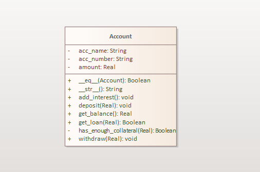

The code below provides the implementation details of this class.

```python
class Account:
    def __init__(self, acc_number: str, amount: float, name: str):
        self.acc_number = acc_number
        self.amount = amount
        self.name = name

    def get_balance(self) -> float:
        return self.amount

    def __eq__(self, other: Account) -> bool:
        if isinstance(other, Account):
            return self.acc_number == other.acc_number

    def deposit(self, amount: float) -> bool:
        if amount > 0:
            self.amount += amount

    def withdraw(self, amount: float) -> None:
        if (amount > 0) and (amount <= self.amount):
            self.amount -= amount

    def _has_enough_collateral(self, loan: float) -> bool:
        if loan < self.amount / 2:
            return True

    def __str__(self) -> str:
        return f'Account acc number : {self.acc_number} amount : {self.amount}'

    def add_interest(self) -> None:
        self.deposit(0.1 * self.amount)

    def get_loan(self, amount : float) -> bool:
        if self._has_enough_collateral(amount):
            return True
        else:
            return False
```

The application is a success and after a month, the client comes back to Joe asking for more features. The client says that he now wants the application to work with more than one type of account. The application should now process SavingsAccount and CheckingAccount accounts. The difference between them is outlined below.

- When authorizing a loan, a checking account needs a
  balance of two thirds the loan amount, whereas savings accounts require only one half the loan amount.

- The bank gives periodic interest to savings accounts but not checking accounts.

- The representation of an account will return
  "Savings Account" or "Checking Account," as appropriate.

Joe rolls up his sleeves and starts to make modifications to the original Account class to introduce the new features. Below is his approach.

**Bad** 😠

```python
class Account:
    def __init__(self, acc_number: str, amount: float, name: str, type : int):
        self.acc_number = acc_number
        self.amount = amount
        self.name = name
        self.type = type

    def _has_enough_collateral(self, loan: float) -> bool:
        if self.type == 1:
            return self.amount >= loan / 2;
        elif self.type == 2:
            return self.amount >= 2 * loan / 3;
        else:
            return False

    def __str__(self) -> str:
        if self.type == 1:
            return ' SavingsAccount'
        elif self.type == 2:
            return 'CheckingAccount'
        else:
            return 'InvalidAccount'

    def add_interest(self) -> None:
        if self.type == 1: self.deposit(0.1 * self.amount)

    def get_loan(self, amount : float) -> bool:
        True if self._has_enough_collateral(amount) else False

    #... other methods
```

> **Note:** We have only shown the methods that changed.

With this implementation, Joe is happy and he ships the app into production since it works as the client had wanted. But something has really gone wrong here.

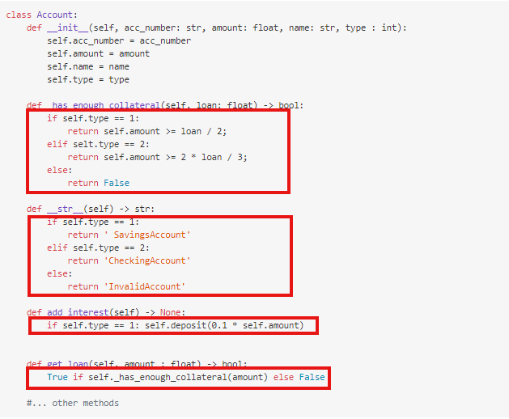

The problem are these conditionals here. They work for now but they will cause a maintenance nightmare very soon. What will happen if the client comes back asking Joe to add more account types? Joe will have to open this class and add more IFs. What happens if the client asks him to delete some of the account types? He will open the same class and edit all Ifs again.

This class is now violating the **Single Responsibility Principle** and the **Open Closed Principle**. The class has more than one reason to change and still, it is not closed for modification and
these IFs may also run slow.

This smell is called the **Missing Hierarchy** smell.

> **Missing Hierarchy** <br/>
> This smell happens when a code segment uses conditional logic (typically in conjunction
> with "tagged types") to explicitly manage variation in behavior where a hierarchy
> could have been created and used to encapsulate those variations.

To solve this problem, we will need to introduce a hierarchy of account types.
We will achieve this by creating a super abstract class Account and implement all the common methods but mark the account specific methods abstract.
Different account types can then inherit from this base class.

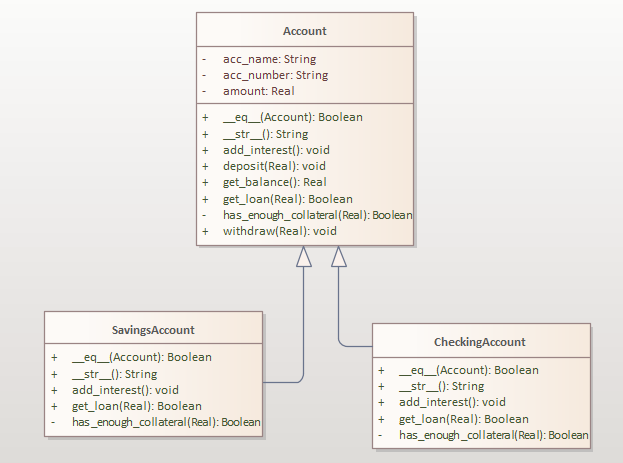

With this new approach, account specific methods will be implemented by subclasses and note that we will throw away those annoying IFs and replace them with polymorphism hence the **Replace Conditionals with Polymorphism** rule.

Below are the implementation of Account, SavingsAccount and CheckingAccount.

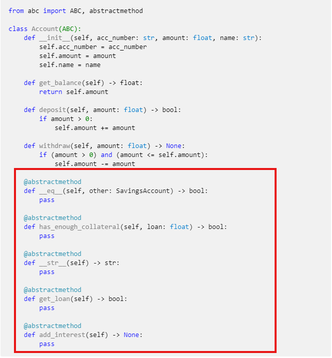

**SavingsAccount class**

**Good** 😊

```python
class SavingAccount(Account):
    def __init__(self, acc_number: str, amount: float, name: str):
        Account.__init__(self, acc_number, amount, name)

    def __eq__(self, other: SavingsAccount) -> bool:
         if isinstance(other, SavingsAccount):
            return self.acc_number == other.acc_number

    def _has_enough_collateral(self, loan: float) -> bool:
        return self.amount >= loan / 2;

    def get_loan(self, amount : float) -> bool:
        return _has_enough_collateral(float)

    def __str__(self) -> str:
        return f'Saving Account acc number : {self.acc_number}'

    def add_interest(self) -> None:
        self.deposit(0.1 * self.amount)
```

**CheckingAccount class**

**Good** 😊

```python
class CheckingAccount(Account):
    def __init__(self, acc_number: str, amount: float, name: str):
        Account.__init__(self, acc_number, amount, name)

    def __eq__(self, other: SavingsAccount) -> bool:
         if isinstance(other, CheckingAccount):
            return self.acc_number == other.acc_number

    def has_enough_collateral(self, loan: float) -> bool:
        return self.amount >= 2 * loan / 3;

    def get_loan(self, amount : float) -> bool:
        return _has_enough_collateral(float)

    def __str__(self) -> str:
        return f'Checking Account acc number : {self.acc_number}'

    #empty method.
    def add_interest(self) -> None:
        pass
```

Notice that each branch of the original annoying `if else` is now implemented in its class. Now if the client comes back and asks Joe to add a fixed deposit account, Joe will just create a new class called FixedDeposit and it will inherit from that abstract Account class. With this design, note that :

- To add new functionality, we add more classes and ignore all existing classes. This is the **Open Closed Principle.**

Note that the CheckingAccount class leaves the add_interest method empty. This is a code smell known as the **Rebellious Hierarchy** design smell and we shall fix it later when we get to the **Interface Segregation Principle**.

> **REBELLIOUS HIERARCHY** <br>
> This smell happens when a subtype rejects the methods provided by its supertype(s).
> In this smell, a supertype and its subtypes conceptually share an IS-A relationship,
> but some methods defined in subtypes violate this relationship. For example, for
> a method defined by a supertype, its overridden method in the subtype could:
>
> - throw an exception rejecting any calls to the method
> - provide an empty (or NOP i.e., NO Operation) method
> - provide a method definition that just prints "should not implement" message
> - return an error value to the caller indicating that the method is unsupported.

After a year, Joe's client comes back and asks Joe to add a Current account. Guess what Joe does? You guessed right, he just creates a new class for this new account and inherits from Account class as shown in the figure below.
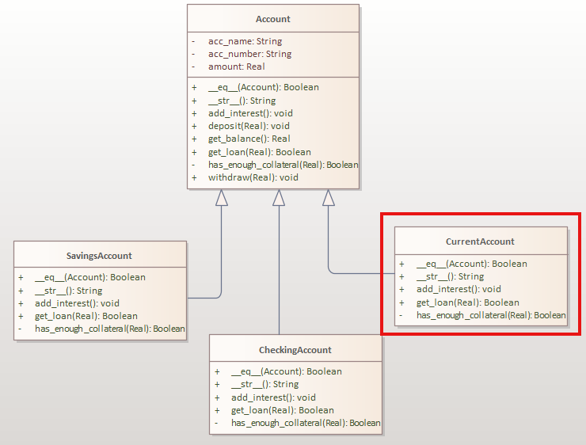

**[⬆ back to top](#table-of-contents)**

### Use-Descriptive-Names

---

Function names should clearly describe what the function does. A good function name should make the code read like well-written prose.

**Bad** 😠

```python
def process(data):
    """What does this process?"""
    return data.strip().lower()

def calc(x, y):
    """Calculate what?"""
    return x * y + 2 * x + 1

def get_info(user):
    """Get what info?"""
    return f"{user.name} - {user.email}"

def do_stuff(items):
    """Do what stuff?"""
    total = 0
    for item in items:
        total += item.price
    return total
```

**Good** 😊

```python
def clean_user_input(data):
    """Clean and normalize user input."""
    return data.strip().lower()

def calculate_quadratic_value(x, y):
    """Calculate quadratic value for given x and y."""
    return x * y + 2 * x + 1

def format_user_summary(user):
    """Format user information for display."""
    return f"{user.name} - {user.email}"

def calculate_order_total(items):
    """Calculate total price of all items in order."""
    total = 0
    for item in items:
        total += item.price
    return total
```

**More examples of descriptive names:**

**Bad** 😠

```python
def handle(data):
    """Handle what?"""
    if data['type'] == 'user':
        return process_user(data)
    elif data['type'] == 'order':
        return process_order(data)

def check(x):
    """Check what?"""
    return x > 0 and x < 100

def update(obj):
    """Update what?"""
    obj.last_modified = datetime.now()
    return obj
```

**Good** 😊

```python
def process_business_data(data):
    """Process business data based on type."""
    if data['type'] == 'user':
        return process_user_data(data)
    elif data['type'] == 'order':
        return process_order_data(data)

def is_valid_percentage(value):
    """Check if value is a valid percentage."""
    return value > 0 and value < 100

def update_last_modified_timestamp(obj):
    """Update the last modified timestamp of an object."""
    obj.last_modified = datetime.now()
    return obj
```

**Guidelines for descriptive function names:**

1. **Use verbs**: Function names should start with verbs (`calculate`, `process`, `validate`)
2. **Be specific**: `calculate_total` is better than `calculate`
3. **Include context**: `calculate_order_total` is better than `calculate_total`
4. **Avoid abbreviations**: `calculate` not `calc`
5. **Use domain language**: Use terms from your business domain

**Examples of good naming patterns:**

```python
# Validation functions
def is_valid_email(email):
def validate_user_data(user_data):
def check_permissions(user, resource):

# Calculation functions
def calculate_tax(amount, rate):
def compute_discount(price, discount_percent):
def determine_shipping_cost(weight, distance):

# Data processing functions
def format_currency(amount):
def normalize_phone_number(phone):
def parse_user_input(input_string):

# Action functions
def save_user_to_database(user):
def send_notification_email(user, message):
def generate_report(data):
```

**Benefits of descriptive names:**

1. **Self-documenting code**: Names explain what the code does
2. **Easier to understand**: No need to read implementation
3. **Easier to maintain**: Clear purpose makes changes easier
4. **Easier to test**: Clear expectations for what to test
5. **Easier to debug**: Clear understanding of what went wrong

**[⬆ back to top](#table-of-contents)**

### Function-Arguments

---

Functions should have as few arguments as possible. The more arguments a function has, the harder it is to understand, test, and use. Aim for functions with 0-2 arguments.

**Bad** 😠

```python
def create_user(first_name, last_name, email, phone, address, city, state, zip_code, country, date_of_birth, gender, occupation, company, department, manager, salary, start_date, end_date, status, notes):
    """Too many arguments - hard to use and understand."""
    return {
        'first_name': first_name,
        'last_name': last_name,
        'email': email,
        # ... many more fields
    }

def calculate_tax(amount, rate, state_rate, federal_rate, local_rate, surcharge, discount, rebate, exemption, deduction):
    """Too many arguments - confusing."""
    base_tax = amount * rate
    state_tax = amount * state_rate
    # ... complex calculation
    return total_tax
```

**Good** 😊

```python
def create_user(user_data):
    """Create user with structured data."""
    return {
        'first_name': user_data.first_name,
        'last_name': user_data.last_name,
        'email': user_data.email,
        # ... other fields
    }

def calculate_tax(amount, tax_config):
    """Calculate tax with configuration object."""
    base_tax = amount * tax_config.base_rate
    state_tax = amount * tax_config.state_rate
    # ... calculation using config
    return total_tax

# Usage
user_data = UserData(
    first_name="John",
    last_name="Doe",
    email="john@example.com"
)
user = create_user(user_data)

tax_config = TaxConfig(
    base_rate=0.1,
    state_rate=0.05,
    federal_rate=0.15
)
tax = calculate_tax(1000, tax_config)
```

**Strategies for reducing arguments:**

1. **Use objects/classes**: Group related data into objects
2. **Use data structures**: Lists, dictionaries, or named tuples
3. **Use builder pattern**: For complex object creation
4. **Split functions**: Break large functions into smaller ones
5. **Use default values**: Provide sensible defaults

**More examples:**

**Bad** 😠

```python
def send_email(to, subject, body, from_address, cc, bcc, attachments, priority, delivery_time, retry_count, timeout):
    """Too many arguments."""
    # Email sending logic
    pass

def process_order(customer_id, product_id, quantity, price, discount, tax_rate, shipping_cost, payment_method, billing_address, shipping_address):
    """Too many arguments."""
    # Order processing logic
    pass
```

**Good** 😊

```python
def send_email(email_request):
    """Send email with request object."""
    # Email sending logic using email_request object
    pass

def process_order(order):
    """Process order object."""
    # Order processing logic using order object
    pass

# Usage
email_request = EmailRequest(
    to="user@example.com",
    subject="Welcome",
    body="Welcome to our service",
    from_address="noreply@company.com"
)
send_email(email_request)

order = Order(
    customer_id=123,
    items=[OrderItem(product_id=456, quantity=2, price=29.99)],
    payment_method="credit_card",
    billing_address=Address(...),
    shipping_address=Address(...)
)
process_order(order)
```

**When to use different argument counts:**

- **0 arguments**: Pure functions, simple operations
- **1 argument**: Transformations, validations, single operations
- **2 arguments**: Binary operations, comparisons
- **3+ arguments**: Consider using objects or splitting the function

**Benefits of fewer arguments:**

1. **Easier to use**: Less to remember when calling the function
2. **Easier to test**: Fewer combinations to test
3. **Easier to understand**: Clear purpose and usage
4. **Easier to maintain**: Changes are localized
5. **Less error-prone**: Fewer parameters to get wrong

**[⬆ back to top](#table-of-contents)**

### Avoid-Side-Effects

#### **Pure Functions**

---

What on earth is a pure function? Well, simply put, a pure function is one without side effects.
Side effects are invisible inputs and outputs from functions. In pure Functional programming, functions behave like mathematical functions. Mathematical functions are transparent-- they will always return the same output when given the same input. Their output only depends on their inputs.

Below are examples of functions with side effects:

#### 1. **Niladic-Functions**

---

**Bad** 😠

```python
class Customer:
    def __init__(self, first_name : str)-> None:
        self.first_name = first_name

    #This method is impure, it depends on global state.
    def get_name(self):
        return self.first_name

    #more code here
```

Niladic functions have this tendency to depend on some invisible input especially if such a function is member function of a class. Since all class members share the same class variables, most methods aren't pure at all. Class variable values will always depend on which method was called last. In a nutshell, most niladic functions depend on some **global state** in this case `self.first_name`.

The same can be said to functions that return None. These too aren't pure functions. If a function doesn't return, then it is doing something that is affecting global state. **Such functions can not be composed in fluent APIs.** The sort method of the list class has side effects, it changes the list in place whereas the sorted builtin function has not side effects because it returns a new list.

> `sort()` and `reverse()` are now discouraged and instead using the built-in `reversed()` and `sorted()` are encouraged.

**Bad** 😠

```python
names = ['Kasozi', 'Martin', 'Newton', 'Grady']

#wrong: sorted_names now contains None
sorted_names = names.sort()

#correct: sorted_names now contain the sorted list
sorted_names = sorted(names)
```

> **static methods** <br>
> One way to solve this problem is to use static methods inside a class. Static methods know nothing about the class data and hence their outputs only depend on their inputs.

#### 2. **Argument Mutation**

---

Functions that mutate their input arguments aren't pure functions. This becomes more pronounced when we run on multiple cores. More than one function may be reading from the same variable and each function can be context switched from the CPU at any time. If it was not yet done with editing the variable, others will read garbage.

**Bad** 😠

```python
from typing import List

Marks = List[int]

marks = [43, 78, 56, 90, 23]

def sort_marks(marks : Marks) -> None:
    marks.sort()

def calculate_average(marks : Marks) -> float:
    return sum(marks)/float(len(marks))
```

From the above code snippet, we have two functions that both read the same list. `sort_marks()` mutates its input argument and this is not good. Now imagine a scenario when `calculate_average_mark()` was running and before it completed, it was context switched and `sort_marks()` allowed to run.

sort_marks will update the list in place and change the order of elements in the list, by the time `calculate_average_average()` will run again, it will be reading garbage.

**Good** 😊

```python
from typing import List

Marks = List[int]

marks = [43, 78, 56, 90, 23]

#sort_marks now returns a new list and uses the sorted function

#Mutates input argument
def sort_marks(marks : Marks) -> Marks:
    return sorted(marks)

# Doesn't mutate input argument
def find_average_mark(marks : Marks) -> float:
    return sum(marks)/len(marks)
```

This problem can also be solved by using immutable data structures.

> Function purity is also vital for unit-testing. Impure functions are hard to test especially if the side effect has to do with I/O. Unlike mutation, you can't avoid side effects related to I/O; whereas mutation is an implementation detail, I/O is usually a requirement.

#### 3. **Exceptions**

---

Some function signatures are more expressive than others, by which I mean that they give us
more information about what the function is doing, what inputs are permissible, and what outputs we can expect. The signature `() → ()`, for example, gives us no information at all: it may print some text, increment a counter, launch a spaceship... who knows! On the other hand, consider this signature:

`(List[int], (int → bool)) → List[int]`

Take a minute and see if you can guess what a function with this signature does. Of course, you
can't really know for sure without seeing the actual implementation, but you can make an
educated guess. The function returns a list of `ints` as input; it also takes a list of `ints`, as well as a
second argument, which is a function from int to `bool`: a predicate on int.

But is not honest enough. What happens if we pass in an empty list? This function may throw an exception.

> Exceptions are hidden outputs from functions and functions that use exceptions have side effects.

**Bad** 😠

```python
def find_quotient(first : int, second : int)-> float:
    try:
        return first/second
    except ZeroDivisionError:
        return None
```

What is wrong with such a function? In its signature, it claims to return a float but we can see that sometimes it fails. Such a function is not honest and such functions should be avoided.

> Functional languages handle errors using other means like Monads and Options. Not with exceptions.

#### 4. **I/O**

---

Functions that perform input/output aren't pure too. Why? This is because they return different outputs when given the same input argument. Let me explain more about this. Imagine a function that takes in an URL and returns HTML, if the HTML is changed, the function will return a different output but it is still taking in the same URL. Remember mathematical functions don't behave like this.

**Bad** 😠

```python
def read_HTML(url : str)-> str:
    try:
        with open(url) as file:
            data = file.read()
        data = file.read()
        return data
    except FileNotFoundError:
        print('File Not found')
```

This function is plagued with more than one problem.

- Its signature is not honest. It claims that the function returns a string and takes in a string but from the implementation, we see it can fail.
- This function is performing IO. IO operations produce side effects and thus this function is not pure.

> You can build pure functions in python with the help of the **operator** and **functools** modules. There is a package **fn.py** to support functional programming in Python 2 and 3. According
> to its author, Alexey Kachayev, fn.py provides "implementation of missing features to
> enjoy FP" in Python. It includes a @recur.tco decorator that implements tail-call optimization
> for unlimited recursion in Python, among many other functions, data structures,
> and recipes.

### Command-Query-Separation

---

Functions should either do something (command) or answer something (query), but not both. This principle helps make code more predictable and easier to understand.

**Bad** 😠

```python
def get_user_and_update_last_login(user_id):
    """This function does both - queries and modifies."""
    user = database.get_user(user_id)
    user.last_login = datetime.now()
    database.save_user(user)
    return user

def calculate_total_and_save(items):
    """This function does both - calculates and saves."""
    total = sum(item.price for item in items)
    database.save_total(total)
    return total

def process_order_and_send_email(order):
    """This function does both - processes and sends email."""
    order.status = 'processed'
    database.save_order(order)
    email_service.send_confirmation(order.customer_email)
    return order
```

**Good** 😊

```python
# Commands - do something, return void or status
def update_user_last_login(user_id):
    """Update user's last login time."""
    user = database.get_user(user_id)
    user.last_login = datetime.now()
    database.save_user(user)

def save_order_total(total):
    """Save the calculated total."""
    database.save_total(total)

def process_order(order):
    """Process an order."""
    order.status = 'processed'
    database.save_order(order)

def send_order_confirmation(order):
    """Send confirmation email for order."""
    email_service.send_confirmation(order.customer_email)

# Queries - answer something, don't modify state
def get_user(user_id):
    """Get user by ID."""
    return database.get_user(user_id)

def calculate_order_total(items):
    """Calculate total price of items."""
    return sum(item.price for item in items)

def get_order_status(order_id):
    """Get current status of order."""
    order = database.get_order(order_id)
    return order.status

# Usage - separate commands and queries
def handle_order_processing(order):
    """Handle complete order processing."""
    # Query first
    current_status = get_order_status(order.id)

    if current_status == 'pending':
        # Commands
        process_order(order)
        send_order_confirmation(order)

    # Query result
    return get_order_status(order.id)
```

**More examples:**

**Bad** 😠

```python
def validate_and_save_user(user_data):
    """Does both validation and saving."""
    if not user_data.get('email'):
        raise ValueError("Email required")

    user = User(user_data)
    database.save_user(user)
    return user

def get_balance_and_deduct(account_id, amount):
    """Gets balance and modifies it."""
    account = database.get_account(account_id)
    if account.balance >= amount:
        account.balance -= amount
        database.save_account(account)
    return account.balance
```

**Good** 😊

```python
# Commands
def save_user(user):
    """Save user to database."""
    database.save_user(user)

def deduct_from_account(account_id, amount):
    """Deduct amount from account."""
    account = database.get_account(account_id)
    if account.balance >= amount:
        account.balance -= amount
        database.save_account(account)

# Queries
def validate_user_data(user_data):
    """Validate user data."""
    if not user_data.get('email'):
        raise ValueError("Email required")
    return True

def get_account_balance(account_id):
    """Get current account balance."""
    account = database.get_account(account_id)
    return account.balance

# Usage
def create_user(user_data):
    """Create a new user."""
    validate_user_data(user_data)  # Query
    user = User(user_data)
    save_user(user)  # Command
    return user

def transfer_money(from_account, to_account, amount):
    """Transfer money between accounts."""
    # Queries
    from_balance = get_account_balance(from_account)
    to_balance = get_account_balance(to_account)

    if from_balance >= amount:
        # Commands
        deduct_from_account(from_account, amount)
        add_to_account(to_account, amount)
        return True
    return False
```

**Benefits of command-query separation:**

1. **Predictable behavior**: Functions either change state or return data, not both
2. **Easier to test**: Queries are easy to test, commands can be tested for side effects
3. **Easier to debug**: Clear separation of what changes state vs what reads state
4. **Easier to understand**: Function purpose is immediately clear
5. **Safer to use**: No unexpected side effects when calling query functions

**Guidelines:**

- **Commands**: Functions that change state, return void or status
- **Queries**: Functions that return data, don't modify state
- **Avoid mixing**: Don't have functions that both query and command
- **Use descriptive names**: Commands should be verbs, queries should be nouns or "get" functions

**[⬆ back to top](#table-of-contents)**

### Don't Repeat Yourself (DRY)

---

Let us imagine that we are working on a banking application. We all know that such an application will manipulate bank account objects among other things.
Let us assume that at the start of the project, we have only two types of accounts to work with;

- Savings Account
- Checking Account

We roll up our sleeves and put our OOP knowledge to test. We craft two classes to model both and Savings and Checking accounts.

**SavingsAccount class**

**Bad** 😠

```python
class SavingsAccount:
    def __init__(self, acc_number: str, amount: float, name: str):
        self.acc_number = acc_number
        self.amount = amount
        self.name = name

    def get_balance(self) -> float:
        return self.amount

    def __eq__(self, other: SavingsAccount) -> bool:
        if isinstance(other, SavingsAccount):
            return self.acc_number == other.acc_number

    def deposit(self, amount: float) -> bool:
        if amount > 0:
            self.amount += amount

    def withdraw(self, amount: float) -> None:
        if (amount > 0) and (amount <= self.amount):
            self.amount -= amount

    def has_enough_collateral(self, loan: float) -> bool:
        if loan < self.amount / 2:
            return True

    def __str__(self) -> str:
        return f'Saving Account acc number : {self.acc_number}'

    def add_interest(self) -> None:
        self.deposit(0.1 * self.amount)
```

**CheckingAccount class**

**Bad** 😠

```python
class CheckingAccount:
    def __init__(self, acc_number: str, amount: float, name: str):
        self.acc_number = acc_number
        self.amount = amount
        self.name = name

    def get_balance(self) -> float:
        return self.amount

    def __eq__(self, other: SavingsAccount) -> bool:
        if isinstance(other, SavingsAccount):
            return self.acc_number == other.acc_number

    def deposit(self, amount: float) -> bool:
        if amount > 0:
            self.amount += amount

    def withdraw(self, amount: float) -> None:
        if (amount > 0) and (amount <= self.amount):
            self.amount -= amount

    def has_enough_collateral(self, loan: float) -> bool:
        if loan < self.amount / 5:
            return True

    def __str__(self) -> str:
        return f'Checking Account acc number : {self.acc_number}'

    def add_interest(self) -> None:
        self.deposit(0.5 * self.amount)
```

The table describes all the methods added to both classes.

| method                    | description                                         |
| ------------------------- | --------------------------------------------------- |
| `get_balance()`           | returns the account balance                         |
| `__str__()`               | returns the string representation of account object |
| `add_interest()`          | adds a given interest to a given account            |
| `has_enough_collateral()` | checks if the account can be granted a loan         |
| `withdraw()`              | withdraws a given amount from the account           |
| `deposit()`               | deposits an amount to the account                   |
| `__eq__()`                | checks if 2 accounts are the same                   |

The Unified Modeling Language (UML) class diagrams of both classes are shown below. Notice the duplication in method names.

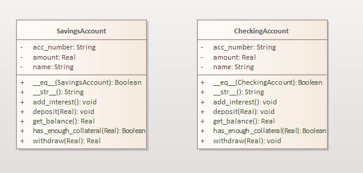

If you look more closely, both these classes contain the same methods and to make it worse, most of these methods contain exactly the same code. This is a **bad** practice and it leads to a maintenance nightmare. Identical code is scattered in more than one place and so if we ever make changes to one of the copies, we have to change all the others.

There is a software principle that helps in solving such a problem and this principle is known as **DRY** for Don't Repeat Yourself.

> The "Don't Repeat Yourself" Rule <br>
> A piece of code should exist in exactly one place.

It is evident from our bad design that we have two classes that both claim to do same thing really well and so we just violated the **Most Qualified Rule**. In most cases, such scenarios arise due to failing to identify similarities between objects in a system.

To solve this problem, we will use inheritance. We will define a new abstract class called BankAccount and we will implement all the method containing the similar logic in this abstract class. Then we will leave the different methods to be implemented by subclasses of BankAccount.

Below is the UML diagram for our new design.

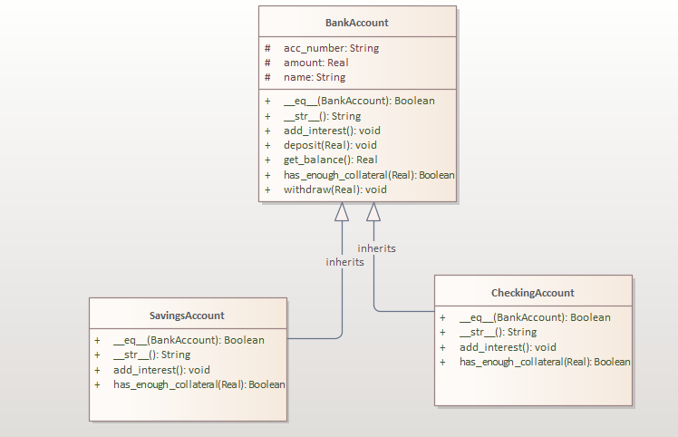

**BankAccount** class

**Good** 😊

```python
from abc import ABC, abstractmethod

class BankAccount(ABC):
    def __init__(self, acc_number: str, amount: float, name: str):
        self.acc_number = acc_number
        self.amount = amount
        self.name = name

    def get_balance(self) -> float:
        return self.amount

    def deposit(self, amount: float) -> bool:
        if amount > 0:
            self.amount += amount

    def withdraw(self, amount: float) -> None:
        if (amount > 0) and (amount <= self.amount):
            self.amount -= amount

    @abstractmethod
    def __eq__(self, other: SavingsAccount) -> bool:
        pass

    @abstractmethod
    def has_enough_collateral(self, loan: float) -> bool:
        pass

    @abstractmethod
    def __str__(self) -> str:
        pass

    @abstractmethod
    def add_interest(self) -> None:
        pass
```

> **Note :** In the BankAccount abstract class, the methods `__eq__()`, `has_enough_collateral()`, `__str__()` and `add_interest()` are abstract and so it is the responsibility of subclasses to implement them.

**SavingsAccount class**

**Good** 😊

```python
class SavingAccount(BankAccount):
    def __init__(self, acc_number: str, amount: float, name: str):
        BankAccount.__init__(self, acc_number, amount, name)

    def __eq__(self, other: SavingsAccount) -> bool:
         if isinstance(other, SavingsAccount):
            return self.acc_number == other.acc_number

    def has_enough_collateral(self, loan: float) -> bool:
        if loan < self.amount / 2:
            return True

    def __str__(self) -> str:
        return f'Saving Account acc number : {self.acc_number}'

    def add_interest(self) -> None:
        self.deposit(0.1 * self.amount)
```

**CheckingAccount class**

**Good** 😊

```python
class CheckingAccount(BankAccount):
    def __init__(self, acc_number: str, amount: float, name: str):
        BankAccount.__init__(self, acc_number, amount, name)

    def __eq__(self, other: SavingsAccount) -> bool:
         if isinstance(other, CheckingAccount):
            return self.acc_number == other.acc_number

    def has_enough_collateral(self, loan: float) -> bool:
        if loan < self.amount / 5:
            return True

    def __str__(self) -> str:
        return f'Checking Account acc number : {self.acc_number}'

    def add_interest(self) -> None:
        self.deposit(0.5 * self.amount)
```

With this new design, if we ever want to modify the methods common to both classes, we only edit them in the abstract class. This simplifies our codebase maintenance. In fact, this way of organizing code is so ideal for implementing the **Replace Ifs with Polymorphism (RIP)** principle as we shall see later.

## **SOLID Principles**

---

### Single Responsibility Principle

---

The single responsibility principle (SRP) tells developers to write code that has one and only one
reason to change. If a class has more than one reason to change, it has more than one responsibility.
Classes with more than a single responsibility should be broken down into smaller classes, each of
which should have only one responsibility and reason to change.

It is difficult to overstate the importance of delegating to abstractions. It is the key to adaptive
code and, without it, developers would struggle to adapt to changing requirements in the way
that Scrum and other Agile processes demand.

Let us meet Vincent. Vincent is a developer and he loves his job really a lot. Vincent loves to keep learning and he buys books that talk about software but he is always busy that he fails to read them. Vincent has a new client that wants an application developed for him.

**_The client wants a program that reads trade records from a file, parse them, log any errors, process the records and them save them to a database._**

The data is stored in the following format. The first 3 capitals are the source currency code, the next 3 capitals are the destination currency code. The first integer is the lot and the last float is the price.

```markdown
UGAUSD,2,45.3
UGAUSD,7,76.4
UGAEUR,7,76.4
HJDSGS,1,76.3
ygfuhf,tj,89
```

With these requirements, Vincent works out a first prototype of this application and tests to see if it works as the client wanted. Below is the class code.

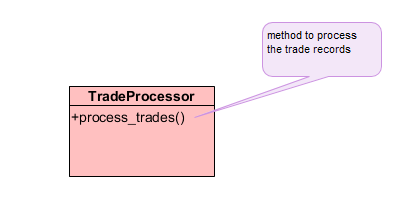

```python
from typing import List
from sqlalchemy import create_engine, Column, Integer, String, Float
from sqlalchemy.orm import sessionmaker
from base import Base

class TradeProcessor(object):
    @staticmethod
    def process_trades(filename):
        lines: List[str] = []
        with open(filename) as ft:
            for line in ft: lines.append(line)
        trades: List[TradeRecord] = []

        for index, line in enumerate(lines):
            fields = line.split(',')
            if len(fields) != 3:
                print(f'Line {index} malformed. Only {len(fields)} field(s) found.')
                continue
            if len(fields[0]) != 6:
                print(f'Trade currencies on line {index} malformed: "{fields[0]}"')
                continue
            trade_amount = 0
            try:
                trade_amount = float(fields[1])
            except ValueError:
                print(f"WARN: Trade amount on line {index} not a valid integer: '{fields[1]}'")

            trade_price = 0
            try:
                trade_price = float(fields[2])
            except ValueError:
                print(f"WARN: Trade price on line {index} not a valid decimal:'{fields[2]}'")

            print(trade_amount)
            sourceCurrencyCode = fields[0][:3]
            destinationCurrencyCode = fields[0][3:]
            trade = TradeRecord(source=sourceCurrencyCode, dest=destinationCurrencyCode,
                                lots=trade_amount, amount=trade_price)
            trades.append(trade)

        engine = create_engine('postgresql://postgres:u2402/598@localhost:5432/python')
        Session = sessionmaker(bind=engine)
        Base.metadata.create_all(engine)
        session = Session()
        for trade in trades:
            session.add(trade)
        session.commit()
        session.close()
```

> **Note :** In this example we used the SqlAlchemy ORM for persistence but we could have used any DB APIs out there.

Below is the code for the TradeRecord class that SqlAlchemy uses to persist our data.

```python
class TradeRecord(Base):
    __tablename__ = 'TradeRecord'
    id = Column(Integer, primary_key=True)
    source_curreny = Column(String)
    dest_currency = Column(String)
    lots = Column(Integer)
    amount = Column(Float)

    def __init__(self, source, dest, lots, amount):
        self.source_curreny = source
        self.dest_currency = dest
        self.lots = lots
        self.amount = amount
```

If you look closely at the TradeProcessor class, it is the best example of a class that has a ton of responsibilities to change. The method `process_trades` is a hidden class within itself. It is doing more than one thing as listed below.

1. It reads every line from a File object, storing each line in a list of strings.
2. It parses out individual fields from each line and stores them in a more structured list of
   Trade­Record instances.
3. The parsing includes some validation and some logging to the console.
4. Each TradeRecord is then stored to a database.

We can see that the responsibilities of the TradeProcessor are :

1. Reading files
2. Parsing strings
3. Validating string fields
4. Logging
5. Database insertion.

The single responsibility principle states that this class, like all others,
should only have a single reason to change. However, the reality of the TradeProcessor is that it will
change under the following circumstances:

- When the client decides not to use a file for input but instead read the trades from a remote call to a web service.
- When the format of the input data changes, perhaps with the addition of an extra field indicating the broker for the transaction.
- When the validation rules of the input data change.
- When the way in which you log warnings, errors, and information changes. If you are using a
  hosted web service, writing to the console would not be a viable option.
- When the database changes in some way for example the client decides not to store the data in a relational database and opt for document storage, or the database is moved behind a web service that
  you must call.

For each of these changes, this class would have to be modified. Furthermore, unless you maintain
a variety of versions, there is no possibility of adapting the TradeProcessor so that it is able to read
from a different input source, for example. Imagine the maintenance headache when you are asked to
add the ability to store the trades in a web service!!!

### **Refactoring towards the SRP**

---

We are going to achieve this in two steps.

1. Refactor for Clarity
2. Refactor for Adaptability

### **Refactor for clarity**

---

The first thing we are going to do is to break down the monstrous `process_trades()` method into smaller more specialized methods that do only one thing. Here we go.
If you look closely, the `process_trades()` method is doing 3 things:

1. Reading data from the file.
2. Parsing and Logging and
3. Storing to the data.

.png>)

So we can see from a very high level refactor it to something like below

```python
 @staticmethod
    def process_trades(filename):
        lines: List[str] = TradeProcessor.__read_trade_data(filename)
        trades: List[TradeRecord] = TradeProcessor.__parse_trades(lines)
        TradeProcessor.__store_trades(trades)
```

> Notice how these 4 smaller methods are easier to test than the original monolith!!

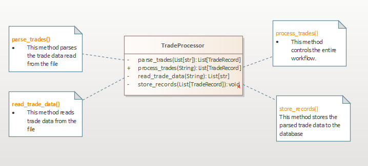
Now let us look into the implementations of these new more focused methods.

#### read_trade_data()

---

```python
@staticmethod
    def __read_trade_data(filename: str) -> List[str]:
        lines: List[str]
        lines = [line for line in open(filename)]
        return lines
```

This method takes in the name of the file to read, it uses a list comprehension to enumerate over the read lines and returns a list of strings. Really simple!!!

#### parse_trades

---

```python
@staticmethod
    def __parse_trades(trade_data: List[str]) -> List[TradeRecord]:
        trades: List[TradeRecord] = []
        for index, line in enumerate(trade_data):
            fields: List[str] = line.split(',')
            if not TradeProcessor.__validate_trade_data(fields, index + 1):
                continue
            trade = TradeProcessor.__create_trade_record(fields)
            trades.append(trade)
        return trades
```

This method takes in a list of strings produced by the `read_trade_data()` methods and tries to parse according to a given structure. **methods should do only one thing** and hence the `parse_trades()` method delegates to two other methods to accomplish its task.

1. The `validate_trade_data()` method. This is responsible for validating the read string to check if it follows a given format.
2. The `create_trade_record()` method. This takes in a list of validated strings and uses them to create a `TradeRecord` object to persist to the database.

Let us work on the implementations of these two new methods.

#### validate_trade_data()

---

```python
   @staticmethod
    def __validate_trade_data(fields: List[str], index: int) -> bool:
        if len(fields) != 3:
            TradeProcessor.__log_message(f'WARN: Line {index} malformed. Only {len(fields)} field(s) found.')
            return False
        if len(fields[0]) != 6:
            TradeProcessor.__log_message(f'WARN: Trade currencies on line {index} malformed: {fields[0]}')
            return False
        try:
            trade_amount = float(fields[1])
        except ValueError:
            TradeProcessor.__log_message(f"WARN: Trade amount on line {index} not a valid integer: '{fields[1]}'")
            return False
        try:
            trade_price = float(fields[2])
        except ValueError:
            TradeProcessor.__log_message(f'WARN: Trade price on line {index} not a valid decimal:{fields[2]}')
            return False
        return True
```

This method should be self explanatory since it is a refactor from the original `process_trades()` method. One thing has changed in it. The method no longer does the logging by itself. It delegates the logging to another method called `log_message()`. We shall see the advantage of this later.

Below is the implementation of the `log_message()` method.

```python
@staticmethod
def __log_message(message: str) -> None:
    print(message)
```

#### create_trade_record()

---

```python
@staticmethod
    def __create_trade_record(fields: List[str]) -> TradeRecord:
        in_curr = slice(0, 3);
        out_curr = slice(3, None)
        source_curr_code = fields[0][in_curr]
        dest_curr_code = fields[0][out_curr]
        trade_amount = int(fields[1])
        trade_price = float(fields[2])

        trade_record = TradeRecord(source_curr_code, dest_curr_code,
                                   trade_amount, trade_price)
        return trade_record
```

This is also straight forward. The reason why we use slice objects here is to make our code readable. The last method we will look at is the `store_trades()` which persists our data to a database.

#### store_trades()

---

```python
@staticmethod
    def __store_trades(trades: List[TradeRecord]) -> None:
        engine = create_engine('postgresql://postgres:54875/501@localhost:5432/python')
        Session = sessionmaker(bind=engine)
        Base.metadata.create_all(engine)
        session = Session()
        for trade in trades:
            session.add(trade)
        session.commit()
        session.close()
        TradeProcessor.__log_message(f'{len(trades)} trades processed')

```

This method uses an ORM known as SQLAlchemy to persist our data. ORMs write the SQL for us behind the scene and this increases the flexibility of our application.

> This method is far from ideal, notice that it hard codes the connection strings and this very bad. There are tons of github repositories with exposed database connection strings. It would be better to read the connection string from a configuration file and add the configure file to gitignore.

At the moment, our class that had only one big method now has a bunch of methods as shown in the following code snippet and UML class diagram:

```python

class TradeProcessor(object):
    @staticmethod
    def process_trades(filename):
        lines: List[str] = TradeProcessor.read_trade_data(filename)
        trades: List[TradeRecord] = TradeProcessor.parse_trades(lines)
        TradeProcessor.store_trades(trades)

    @staticmethod
    def __read_trade_data(filename: str) -> List[str]:
        lines: List[str]
        lines = [line for line in open(filename)]
        return lines

    @staticmethod
    def __log_message(message: str) -> None:
        print(message)

    @staticmethod
    def __validate_trade_data(fields: List[str], index: int) -> bool:
        if len(fields) != 3:
            TradeProcessor.log_message(f'Line {index} malformed. Only {len(fields)} field(s) found.')
            return False
        if len(fields[0]) != 6:
            TradeProcessor.log_message(f'Trade currencies on line {index} malformed: {fields[0]}')
            return False
        try:
            trade_amount = float(fields[1])
        except ValueError:
            TradeProcessor.log_message(f"Trade amount on line {index} not a valid integer: '{fields[1]}'")
            return False
        try:
            trade_price = float(fields[2])
        except ValueError:
            TradeProcessor.log_message(f'Trade price on line {index} not a valid decimal:{fields[2]}')
            return False
        return True

    @staticmethod
    def __create_trade_record(fields: List[str]) -> TradeRecord:
        in_curr = slice(0, 3);
        out_curr = slice(3, None)
        source_curr_code = fields[0][in_curr]
        dest_curr_code = fields[0][out_curr]
        trade_amount = int(fields[1])
        trade_price = float(fields[2])

        trade_record = TradeRecord(source_curr_code, dest_curr_code,
                                   trade_amount, trade_price)
        return trade_record

    @staticmethod
    def __parse_trades(trade_data: List[str]) -> List[TradeRecord]:
        trades: List[TradeRecord] = []
        for index, line in enumerate(trade_data):
            fields: List[str] = line.split(',')
            if not TradeProcessor.validate_trade_data(fields, index + 1):
                continue
            trade = TradeProcessor.create_trade_record(fields)
            trades.append(trade)
        return trades

    @staticmethod
    def __store_trades(trades: List[TradeRecord]) -> None:
        engine = create_engine('postgresql://postgres:u2402/501@localhost:5432/python')
        Session = sessionmaker(bind=engine)
        Base.metadata.create_all(engine)
        session = Session()
        for trade in trades:
            session.add(trade)
        session.commit()
        session.close()
        TradeProcessor.log_message(f'{len(trades)} trades processed')


```

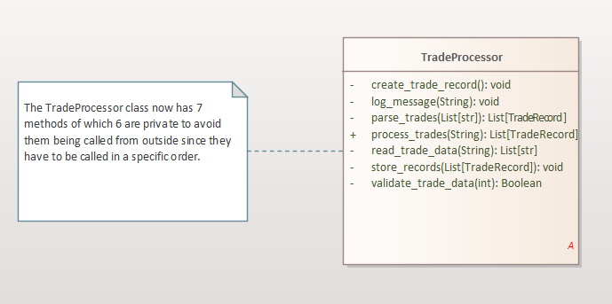

Looking back at this refactor, it is a clear improvement on the original implementation. However, what have you really achieved? Although the new ProcessTrades method is indisputably smaller
than the monolithic original, and the code is definitely more readable, you have gained very little by way of adaptability. You can change the implementation of the LogMessage method so that it, for example, writes to a file instead of to the console, but that involves a change to the TradeProcessor class, which is precisely what you wanted to avoid.

This refactor has been an important stepping stone on the path to truly separating the responsibilities of this class. It has been a **refactor for clarity**, not for adaptability. The next task is to split each responsibility into different classes and place them behind interfaces. What you need is true abstraction to achieve useful adaptability.

### **Refactoring for adaptability**

---

In the previous refactor, we broke down the `process_trades()` method into smaller more focused methods. But still, that didn't solve our problem, our class was still doing lots of things. In this section, we are going to distribute the different responsibilities across classes.

From the previous section, we agreed that our class was serving 3 main responsibilities, Data reading, Data parsing and data storage. So we will start with taking out the code that does that into other classes.

We are going to create 3 abstract classes that will be used by the TradeProcessor class as shown in the following UML diagram.

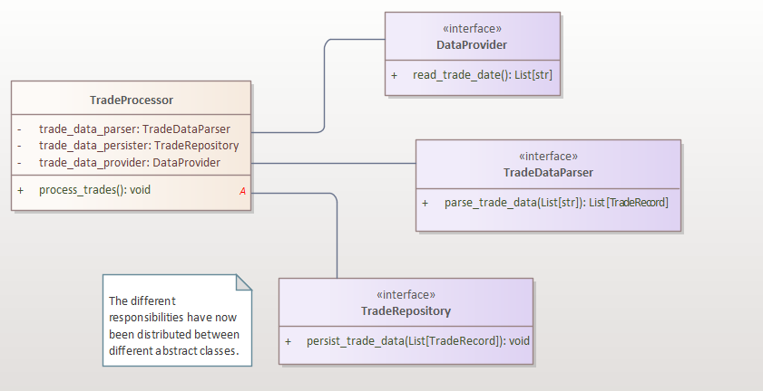

In the above UML diagram, the TradeProcessor class now has private polymorphic hidden fields that it uses to accomplish its tasks. Since we already created smaller specific methods, we know which method goes to which abstraction. Below are the implementations of the new abstract classes.

```python
class DataProvider(ABC):
    @abstractmethod
    def read_trade_data(self):
        pass


class TradeDataParser(ABC):
    @abstractmethod
    def parse_trade_data(self, lines: List[str]) -> List[TradeRecord]:
        pass


class TradeRepository(ABC):
    @abstractmethod
    def persist_trade_data(self, trade_data: List[TradeRecord]) -> None:
        pass
```

Notice that all of them are abstract classes with abstract methods and so can't be directly instantiated. We shall then have implementors of these abstract classes to use with the `TradeProcess()` class.

Below is the new implementation of the TradeProcessor class.

```python
class TradeProcessor(object):
    def __init__(self, provider: DataProvider, parser: TradeDataParser,
                 persister: TradeRepository) -> None:
        self._provider = provider
        self._parser = parser
        self._persister = persister

    def process_trades(self):
        lines = self._provider.read_trade_data()
        trades = self._parser.parse_trade_data(lines)
        self._persister.persist_trade_data(trades)
```

We are now doing it the object oriented way, we are having objects encapsulating computations (wait for the **strategy pattern** later). The objects that do the real work are injected into the TradeProcessor class when it is being instantiated. This is an example of **dependency inversion** which is implemented by the **dependency injection** pattern. More on this later.

The class is now significantly different from its previous incarnation. It no longer contains the
implementation details for the whole process but instead contains the blueprint for the process.
The class models the process of transferring trade data from one format to another. This is its only
responsibility, its only concern, and the only reason that this class should change. If the process itself
changes, this class will change to reflect it. But if you decide you no longer want to retrieve data from
a file, log on to the console, or store the trades in a database, this class remains as is.

> The more observant readers may be asking where the objects injected into the TradeProcessor class come from. Well, they come from a dependency injection container. One thing that the **Single Responsibility Principle** gives rise to are lots of small classes. To assemble such small classes to work well can be a hard thing to do, and that is when dependency injection containers come to the rescue.

Since the `TradeProcessor` class now just models the workflow of converting between trade data formats, it no longer cares about where the data comes from, how it is parsed, validated and where it is stored. This means we can have different implementations of the

`DataProvider` abstraction

- Relational Database
- Text Files
- NoSql Databases
- Web services
- etc

`TradeDataParser` abstraction

- CommaParser
- TabParser
- ColonParser

`TradeRepository` abstraction

- Relational Database
- Text Files
- NoSql Databases
- Web services
- etc

The UML below shows some of the classes implementing the above abstract classes. Notice that we can swap between any of the different implementations and `TradeProcessor` will not even know. This is what software engineers call **loose coupling**.

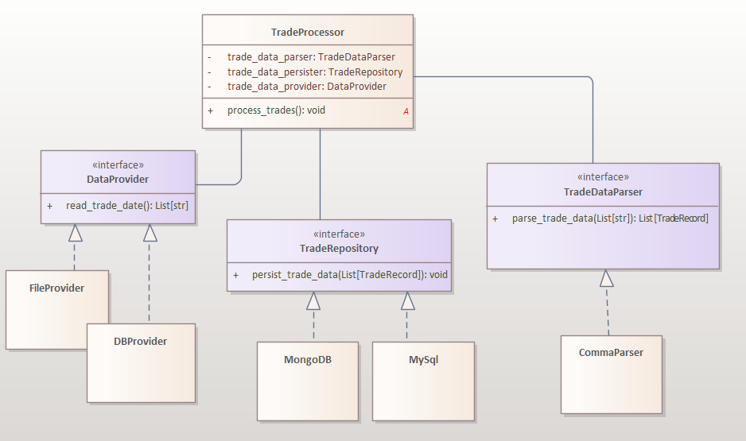

From the above diagram, we are confident that once a new storage mechanism pops up, we just roll up a class to implement the new functionality, we make sure that the class inherits from the right base class. We then inject this new class instance in `TradeProcessor`. This is the **Open Closed Principle** as we will see in the next section.

If you look so closely at the above diagram, you can notice that as new requirements pop up, we get a class **big bang**. We shall solve this problem later when we look at **decorators**.

So far, we have solved 3 problems. These are:

- What happens if we need to use another data source.
- What happens if we need to store the data to a different storage.
- What happens when the business requirements call for a new parsing strategy.

**What happens if new business rules come up that need new validation rules?**

Remember that the original
`parse_trades()` method delegated responsibility for validation and for mapping. You can repeat the
process of refactoring so that the `CommaParser` class does not have more than one responsibility. At the moment, `CommaParser` is implemented as shown below

```python

class CommaParser(TradeDataParser):
    def parse_trade_data(self, trade_data : List[str]) -> List[TradeRecord]:
        trades: List[TradeRecord] = []
        for index, line in enumerate(trade_data):
            fields: List[str] = line.split(',')
            if not CommaParser.__validate_trade_data(fields, index + 1):
                continue
            trade = CommaParser.__create_trade_record(fields)
            trades.append(trade)
        return trades

    @staticmethod
    def __log_message(message: str) -> None:
        print(message)

    def __create_trade_record(self,fields: List[str]) -> TradeRecord:
        in_curr = slice(0, 3);
        out_curr = slice(3, None)
        source_curr_code = fields[0][in_curr]
        dest_curr_code = fields[0][out_curr]
        trade_amount = int(fields[1])
        trade_price = float(fields[2])

        trade_record = TradeRecord(source_curr_code, dest_curr_code,
                                   trade_amount, trade_price)
        return trade_record

    def __validate_trade_data(self, fields: List[str], index: int) -> bool:
        if len(fields) != 3:
            CommaParser.__log_message(f'Line {index} malformed. Only {len(fields)} field(s) found.')
            return False
        if len(fields[0]) != 6:
            CommaParser.__log_message(f'Trade currencies on line {index} malformed: {fields[0]}')
            return False
        try:
            trade_amount = float(fields[1])
        except ValueError:
            CommaParser.__log_message(f"Trade amount on line {index} not a valid integer: '{fields[1]}'")
            return False
        try:
            trade_price = float(fields[2])
        except ValueError:
            CommaParser.__log_message(f'Trade price on line {index} not a valid float:{fields[2]}')
            return False
        return True
```

We can see that the current implementation of `CommaParser` is not ideal. The class is having more than one responsibility to change. So we can refactor out the two methods `__validate_trade_data()` and `__create_trade_record()` into new classes since they both change for different reasons.

We will create 2 new abstractions -- `TradeMapper` (responsible for mapping validated fields into `TradeRecord` instances) and `TradeValidator` (responsible for validating the input data before creating `TradeRecord` instances).

Our new design is shown in the following UML diagram.

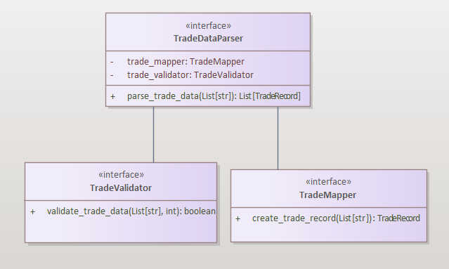

This is a flexible design in such a way that if the parsing rules change, i.e. text is separated by tab and not ',', we just implement `TradeDataParser` in a new class. In case the data validation rules change too, we just roll up a new class inheriting from `TradeValidator`.

Below are the implementations of the new abstractions. Note that the interface for `TradeDataParser` has changed and now takes in instances of `TradeValidator` and `TradeMapper` to help it accomplish it's task

```python

class TradeMapper(ABC):
    @abstractmethod
    def create_trade_record(self, fields: List[str]) -> TradeRecord:
        pass


class TradeValidator(ABC):
    @abstractmethod
    def validate_trade_data(self, fields: List[str], index: int) -> bool:
        pass


class TradeDataParser(ABC):
    @abstractmethod
    def parse_trade_data(self, trade_data: List[str]) -> TradeRecord:
        pass
```

And then here is the new implementation of the CommaParser in terms of these new abstractions.

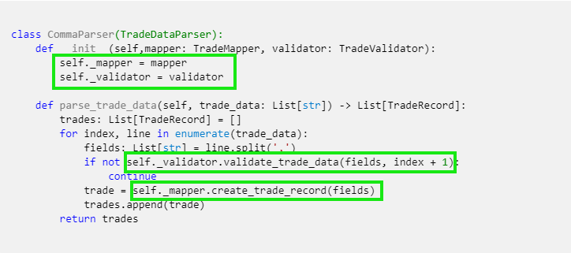

Pay attention to the green rectangles. In the constructor, two dependencies are injected in `mapper` and `validator` and these two are used by CommaParser to parse the input assuming the string components are separated by commas hence the `split(',')`. Other parsers would implement it differently.

Below are possible implementations of the `TradeMapper` and `TradeValidator` abstractions.

```python
class SimpleTradeMapper(TradeMapper):
    def create_trade_record(self, fields: List[str]) -> TradeRecord:
        in_curr = slice(0, 3);
        out_curr = slice(3, None)
        source_curr_code = fields[0][in_curr]
        dest_curr_code = fields[0][out_curr]
        trade_amount = int(fields[1])
        trade_price = float(fields[2])

        trade_record = TradeRecord(source_curr_code, dest_curr_code,
                                   trade_amount, trade_price)
        return trade_record
```

```python

class SimpleValidator(TradeValidator):
    @staticmethod
    def __log_message(message: str) -> None:
        print(message)

    def validate_trade_data(self, fields: List[str], index: int) -> bool:
        if len(fields) != 3:
            SimpleValidator.__log_message(f'Line {index} malformed. Only {len(fields)} field(s) found.')
            return False
        if len(fields[0]) != 6:
            SimpleValidator.__log_message(f'Trade currencies on line {index} malformed: {fields[0]}')
            return False
        try:
            trade_amount = float(fields[1])
        except ValueError:
            SimpleValidator.__log_message(f"Trade amount on line {index} not a valid integer: '{fields[1]}'")
            return False
        try:
            trade_price = float(fields[2])
        except ValueError:
            SimpleValidator.__log_message(f'Trade price on line {index} not a valid float:{fields[2]}')
            return False
        return True

```

We are almost there but still we are having a smell in our design. We would love to be able to log to different destinations -- console, text file or even a database. But if you look closely at the implementations of `TradeRepository` and `TradeValidator`, the logger is hard coded and it always logs to the console.

We have to solve this problem before we run out of business. We are going to refactor this function into its abstraction. The following snippet reveals the snippet for this change.

```python
from abc import ABC, abstractmethod

class TradeLogger(ABC):
    @abstractmethod
    def log_message(self, message):
        pass


class SimpleValidator(TradeValidator):
    def __init__(self, logger: TradeLogger)->None:
        if isinstance(logger, TradeLogger):
            self._logger = logger
        else:
            raise AssertionError('Bad Argument')

    def validate_trade_data(self, fields: List[str], index: int) -> bool:
        if len(fields) != 3:
            self._logger.log_message(f'Line {index} malformed. Only {len(fields)} field(s) found.')
            return False
        if len(fields[0]) != 6:
            self._logger.log_message(f'Trade currencies on line {index} malformed: {fields[0]}')
            return False
        try:
            trade_amount = float(fields[1])
        except ValueError:
            self._logger.log_message(f"Trade amount on line {index} not a valid integer: '{fields[1]}'")
            return False
        try:
            trade_price = float(fields[2])
        except ValueError:
            self._logger.log_message(f'Trade price on line {index} not a valid float:{fields[2]}')
            return False
        return True
```

After all these refactorings, we finally have a collection of abstractions that work together to solve the simple problem we posed at the beginning of this chapter.

The figure below shows the design of the abstractions.

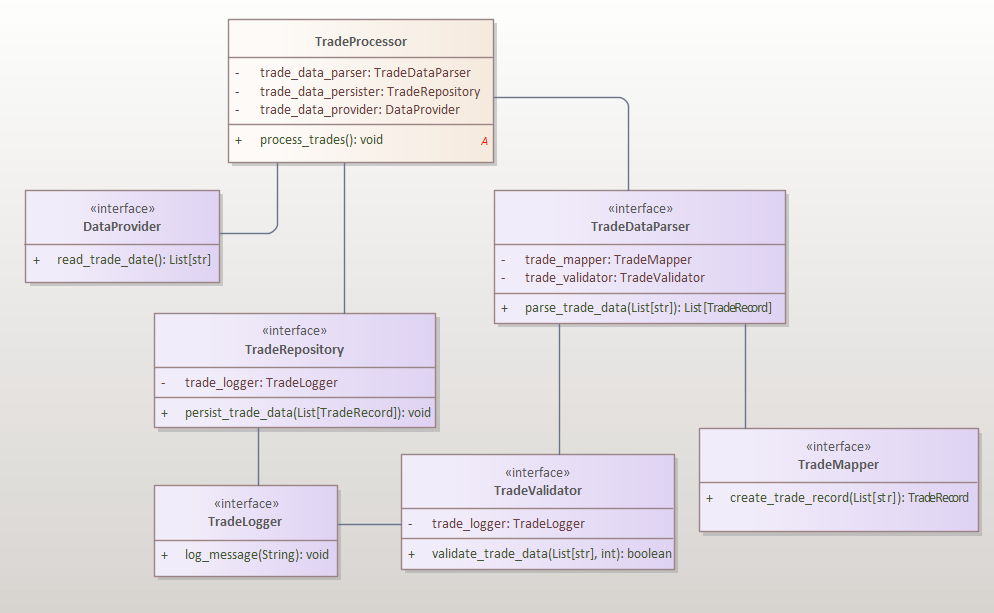

> **Note** that none of these are concrete classes and so they can not be instantiated. To use the `TradeProcessor` class, you will need concrete implementations of all these abstractions and then you will have to wire them together to accomplish a task. **Dependency Injection** containers do this wiring.

From a monolith, we have created a miniature framework for converting trade data between formats. Congratulations!!!!!.

## Open/Closed Principle(OCP)

---

We will now go to the next principle on my list of the SOLID principles of Object Oriented software design--**The Open/Closed Principle**. This principle states that **A software artifact should be closed for modification but open for extension**.

At first, this definition seems to be a paradox. How can a software module be closed for modification but open for extension? Well, we shall see how achieve this goal with the principles we shall discuss in this section.

This term was first coined in 1988 by **Bertrand Meyer** in his book **Object-Oriented Software Construction (Prentice Hall)**. The modern definition of this principle was offered by Martin Roberts and goes as follows

> **Open for extension** : This means that the behavior of the module can be extended.
> As the requirements of the application change, we are able to extend the module
> with new behaviors that satisfy those changes. In other words, we are able to
> change what the module does. <br/> <br/> > **Closed for modification** : Extending the behavior of a module does not result
> in changes to the source or binary code of the module. The binary executable
> version of the module, whether in a linkable library, a DLL, or a Java .jar, remains untouched.

There are 2 exceptions to this rule. Code can be edited if :

1. Fixing bugs.

If a module contains a bug, we can either choose to write a new similar module without the bugs but this would be an overkill solution. So we tend to prefer fixing the buggy module to writing a new one.

2. Client awareness.

Another situation where it is possible to edit the source code of a module is when the changes don't affect the client of the module. This places an
emphasis on how coupled the software modules are, at all levels of granularity: between classes and
classes, assemblies and assemblies, and subsystems and subsystems.

If a change in one class forces a change in another, the two are said to be tightly coupled. Conversely, if a class can change in isolation without forcing other classes to change, the participating
classes are loosely coupled. At all times and at all levels, loose coupling is preferable. Maintaining
loose coupling limits the impact that the OCP has if you allow modifications to existing code that
does not force further changes to clients

To illustrate the OCP rule, we are going to use the following techniques

1. Strategy pattern
1. Decorator design pattern

### Strategy design pattern.

---

> **Strategy Pattern** <br/> Define a family of algorithms, encapsulate each one, and make them interchangeable. Strategy lets the algorithm vary independently from the clients that use it.

This definition seems abstract enough but we are going to try explaining it in the following example.
Consider the following class that is part of an e-commerce application. The class contains a method that selects the which payment to choose for settling a payment as shown below.

**Bad** 😠

```python
class OnlineCart:
    def check_out(self, payment_type: str) -> None:
        if payment_type == 'creditCard':
            self.process_credit_card_payment()
        elif payment_type == 'payPal':
            self.process_paypal_payment()
        elif payment_type == 'GoogleCheckout':
            self.process_google_payment()
        elif payment_type == 'AmazonPayments':
            self.process_amazon_payment()
        else:
            pass

    def process_credit_card_payment(self):
        print('paying with credit card...')

    def process_paypal_payment(self):
        print('Paying with paypal...')

    def process_google_payment(self):
        print('Paying with google check out')

    def process_amazon_payment(self):
        print('Paying with amazon ...')
```

The above class is neither extendable nor flexible. If a new payment method comes up, the conditional logic will have to be changed and a new method added to the class. This class violates the OCP rule and thus needs to be refactored.

There are many ways to solve this simple problem but I will stick with the original solution proposed by the GoF programmers. We will use the **strategy pattern**. We will model each payment method as a class and we will use composition and inject in the payment strategy at run-time.

**Good** 😊

```python
from abc import ABC, abstractmethod

class Payment(ABC):
    def __init__(self, payment_id: str):
        self.id = payment_id

    @abstractmethod
    def pay(self):
        pass

```

This is the interface that all payment strategies are supposed to implement. We are going to use to create a family of payment strategies.

**Good** 😊

```python
class OnlineCart:
    def __init__(self, payment: Payment) -> None:
        if isinstance(payment, Payment):
            self.payment = payment
        else:
            raise AssertionError('Bad argument')

    def check_out(self):
        self.payment.pay()


```

The `OnLineCart` class no longer contains the conditional logic and all the corresponding methods have been pulled out. They will be implemented by the corresponding payment strategies as the following code snippet reveals.

**Good** 😊

```python

class CreditCard(Payment):
    def __init__(self, *, card_number: str) -> None:
        Payment.__init__(self, card_number)

    def pay(self) -> None:
        print(f'Payment made with card number {self.id}')


class Paypal(Payment):
    def __init__(self, *, paypal_id: str) -> None:
        Payment.__init__(self, paypal_id)

    def pay(self) -> None:
        print(f'Payment made with paypal id {self.id}')


class GoogleCheckOut(Payment):
    def __init__(self, *, google_checkout: str) -> None:
        Payment.__init__(self, google_checkout)

    def pay(self) -> None:
        print(f'Payment made with google checkout with id {self.id}')


class AmazonPayment(Payment):
    def __init__(self, *, amazon_payment: str) -> None:
        Payment.__init__(self, amazon_payment)

    def pay(self) -> None:
        print(f'Payment made with amazon services using id {self.id}')


```

To use the `OnlineCart` class, we inject in the payment strategy to use for making the payment as shown in the following snippet.

```python
# we are paying using paypal
paypal : Payment = PayPal(paypal_id='ERTWF342T)
cart : OnlineCart = OnlineCart(paypal)
cart.check_out()
```

Note that the `OnlineCart` class no longer cares about which payment method is being used, it delegates that responsibility to the wrapped object. `OnlineCart` is now open for extension (we can change its behavior by passing in different objects) but it is closed for modification (we don't change its source code to add new functionality).

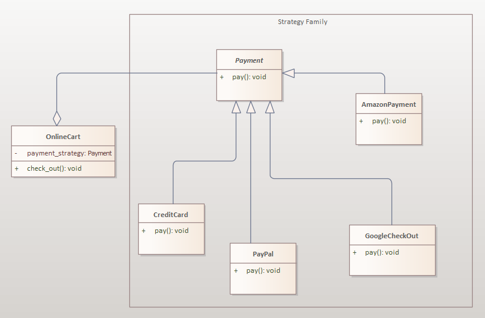

From the above UML class diagram, we can notice that once a new payment method shows up, we just create a new class for that method, inherit from `Payment` and inject it in `OnlineCart`. This code is flexible and extendable.

> **Note**: The same design could be achieved with lambda expressions though at times the logic in the respective strategies may be complex enough that it is implemented in more than one function. This is why i decided to use this rather verbose method.

### The Decorator design pattern

---

> **Decorator Pattern**<br/>Attach additional responsibilities to an object dynamically. Decorators provide a flexible alternative to sub-classing for extending functionality.

The decorator design pattern was first proposed in 1994 in the seminal work of the Gang of Four book. It is a technique of adding capabilities to a class without changing its source code.
We are going to view this under various examples.

We are going to continue with our example in the previous section. Consider that we want to add some logging information after making the payment. There are many ways to solve this problem and one of them is to edit the `OnlineCart` class to add logging features as shown below;

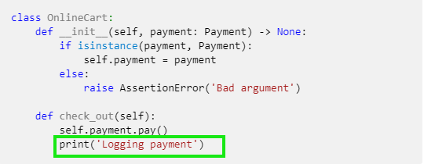

This is a **code smell**. Notice that we have modified the class, this is violation of the Open/Closed principle. There is even a more serious problem than this one. In this case we are logging to the console, what will happen if we want to log to a database or to a text file? We will have to constantly open this class and modify it, this is serious violation of the OCP rule.

One solution to this problem is the **decorator pattern**. Decorators are just classes that wrapper other classes. The **wrapped classes** have exactly the same interface as the **wrapper classes**. We achieve this by using both **composition** and **inheritance** as the following UML diagram reveals.

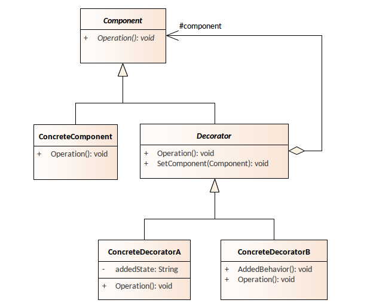

In this case, the `Component` is an interface that is both supported by `ConcreteComponent` and `Decorator` this means that both `ConcreteComponent` and `Decorator` can be swapped without breaking existing code.

Notice also that the `Decorator` contains a `Component` inside it implying that it delegates some of its tasks to the wrapped component.

Let us use this technique to add logging capabilities to the `OnlineCart` class without having to modify it.

Looking very closely at the code for `OnlineCart`, notice that the `Payment` object is being injected during the instantiation of the class and so the `OnlineCart` class doesn't control what type of payment it receives (remember `Payment` is polymorphic).

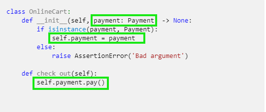

This means we can inject in anything that is similar to `Payment`. That is what the **Decorator pattern** is based on. **Dependency Injection** is the prerequisite to achieving all this flexibility. We shall cover dependency injection fully under the **Dependency Inversion Principle (DIP)**.

The following diagram shows the idea behind the decorator pattern.
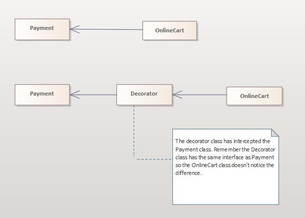

In the first row, the `OnlineCart` class is directly depending on the `Payment` abstraction. In the second row, the `OnlineCart` class no longer depends directly on the `Payment` abstraction, there has been some redirection.

Ok!! time for some code.

Below is the code for our abstract decorator class.

```python
class Decorator(Payment, ABC):
    def __init__(self, payment: Payment) -> None:
        if isinstance(payment, Payment):
            self.payment = payment
        else:
            raise AssertionError('Bad argument')

    @abstractmethod
    def pay(self):
        pass
```

Pay close attention to this class.

1. It uses multiple inheritance : This is because we need the class to both be abstract and still inherit from the `Payment` class.
2. It takes in a `Payment` dependency and inherits from `Payment`. This is typical of decorator classes.
3. The `pay()` method is abstract since concrete decorators will have to define their implementations.

We can now implement our `Logging` decorator that adds logging capabilities to the `OnlineCart` class without modifying it. Let's go!!!

```python
class ConsoleLoggingDecorator(Decorator):
    def __init__(self, payment: Payment):
        Decorator.__init__(self, payment)

    def pay(self):
        self.payment.pay()
        print(f'Logging Payment made with id {self.payment.id}')
```

Simple!!! This is the console logging decorator because it logs on the console using `print`. We can create a file logging decorator that logs into a text file as shown below.

```python
class FileLoggingDecorator(Decorator):
    def __init__(self, *, payment: Payment, filename: str):
        Decorator.__init__(self, payment)
        self.filename = filename

    def pay(self):
        self.payment.pay()
        _file = open(self.filename, 'a')
        _file.writelines(f'{self.payment.id} payment logged\n')
        _file.close()
```

The snippet shows the code that sets up the `OnlineCart` class to use the `ConsoleLoggingDecorator` and then the `FileLoggingDecorator`

```python
#using the console logger
credit_card: Payment = CreditCard(card_number='RTGW@#')
decorator: FileLoggingDecorator = ConsoleLoggingDecorator(payment=credit_card)
cart: OnlineCart = OnlineCart(decorator)
cart.check_out()

#using the file logger
credit_card: Payment = CreditCard(card_number='RTGW@#')
decorator: FileLoggingDecorator = FileLoggingDecorator(filename='dta.txt', payment=paypal)
cart: OnlineCart = OnlineCart(decorator)
cart.check_out()
```

**Note**: We first create a bare payment object and then wrap it in a decorator which we then inject into `OnlineCart` class. The decorator adds some capabilities (in this case logging) to the payment object.

We can add any functionality to the `OnlineCart` class without modifying it. Capabilities like Profiling, Laziness, Immutability, etc.

The following UML class diagram shows our work up to to this point in time.

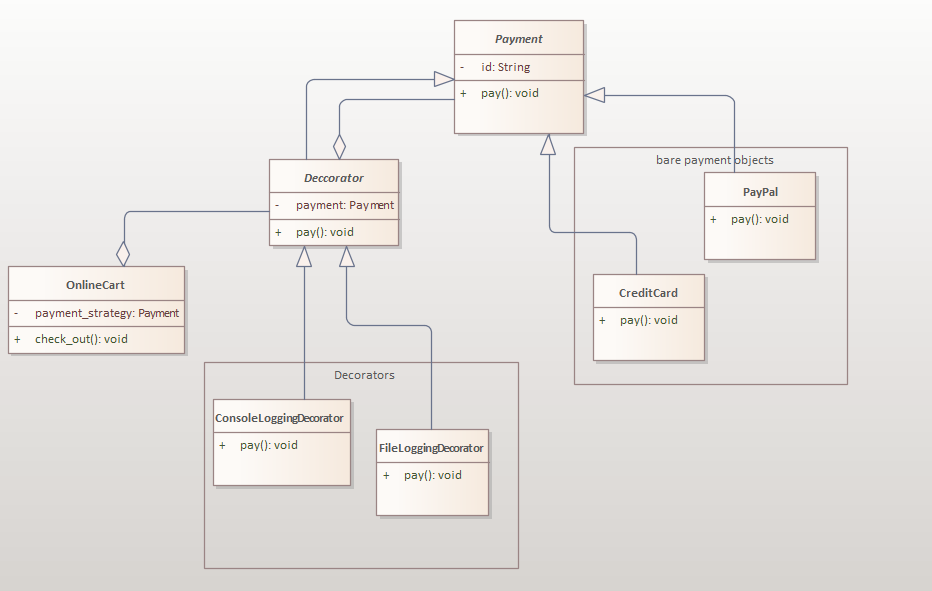

We can add more organization to the decorator hierarchy by using the **Template pattern**. That will be a story for the next time.

## Liskov Substitution Principle